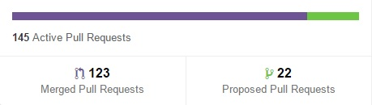
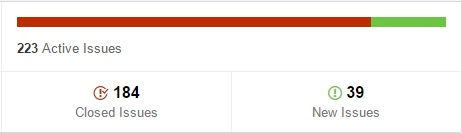

# Relatório 2 - ESOF
## Facebook/React - Gestão de Requisitos

### Levantamento de Requisitos

Antes de se iniciar a discussão acerca da gestão de requisitos num projeto como o React, é necessário perceber claramente o contexto de desenvolvimento *open-source* em que o mesmo se enquadra. Os conceitos estudados nas aulas teóricas da Unidade Curricular de Engenharia de Software estão ligeiramente mais adaptados a projetos de *software* proprietário e, nesse sentido, aplicam-se apenas em parte a um projeto comunitário e sem fins lucrativos como é o React.

Na fase em que o projeto se encontra, os novos requisitos são determinados pela lista de *issues* levantados pela comunidade, assim como pelos *pull requests* que os colaboradores podem submeter para apreciação da *core team*, conforme discutido no [Relatório 1](./Relatorio_1.md). Não existe uma definição clara dos requisitos futuros, mas apenas um direcionamento e validação das sugestões supramencionadas com vista à sua integração na biblioteca, sem comprometer a estabilidade do projeto a longo prazo. Importa, no entanto, explorar a motivação por parte do Facebook em desenvolver o React, descrevendo, em seguida, os seus casos de uso típicos e apresentando alguns requisitos próprios do React que o diferenciam de outras bibliotecas de JavaScript, nomeadamente a criação de *single-page applications* e isomorfismo.

#### Motivação

A principal [motivação](http://reactjs.de/posts/react-tutorial) por trás do desenvolvimento da biblioteca React foi a vontade do Facebook em tornar o seu código *front-end*, isto é, o código que corre no lado do cliente, de uma compreensão e manutenção mais fáceis. Antes do aparecimento do React, visualizar o comportamento do código existente era um processo moroso. Certas partes do código eram tão complexas que apenas os membros de um dado grupo de colaboradores conseguiam tratá-las. Erros de sincronização eram muito frequentes, com perdas de mensagens na comunicação entre cliente e servidor.

O objetivo do React é, assim, possibilitar a escrita de código mais simples, definindo componentes que não estejam tão enredados e dependentes entre si, como acontecia anteriormente, diminuindo, assim, a complexidade de programação. Estes são, de uma forma geral, os requisitos não funcionais do React.

#### Casos de Uso

O diagrama seguinte mostra os casos de uso típicos do React, descrevendo, de forma geral, os requisitos funcionais desta biblioteca.

O React é usado por sistemas que integram interfaces gráficas para o utilizador. Estes sistemas fazem, portanto, parte do grupo de [*stakeholders*](https://en.wikipedia.org/wiki/Project_stakeholder) do projeto. Os mesmos devem poder incluir a biblioteca com o objetivo principal de criar uma Vista para interação com o utiizador. A criação de uma Vista envolve a criação de [elementos](https://facebook.github.io/react/docs/component-api.html) da mesma, os quais podem ser *tags* de HTML ou de tipos (classes) definidos pelo programador. Uma classe pode ser definida estendendo a classe [React.Component](https://facebook.github.io/react/docs/component-api.html), usando a [sintaxe ES6](https://facebook.github.io/react/docs/reusable-components.html#es6-classes), ou recorrendo ao *wrapper* especial [React.createClass](https://facebook.github.io/react/docs/top-level-api.html#react.createclass). É, ainda, possível realizar a [validação dos tipos de dados](https://facebook.github.io/react/docs/reusable-components.html#prop-validation) que cada elemento recebe durante a execução da aplicação.

Ao criar elementos representados por *tags* de HTML, isto é, componentes do *Document Object Model* (DOM), podem ser usados *wrappers* especiais definidos pela classe [React.DOM](https://facebook.github.io/react/docs/top-level-api.html#react.dom). Esta funcionalidade do React é de particular relevância, pois a sua definição constitui um dos princípios fundamentais desta biblioteca, contribuindo para uma maior facilidade no desenvolvimento das chamadas *single-page applications*.

#### *Single-Page Applications*

Uma [*single-page application*](https://en.wikipedia.org/wiki/Single-page_application) é uma aplicação Web que corre numa única página, conforme referido no [Relatório 1](./Relatorio_1.md#descricao). A biblioteca React confere maior facilidade no desenvolvimento deste tipo de aplicações, cujo objetivo é fornecer uma experiência semelhante à de aplicações *desktop*, ou recebendo todo o código necessário à sua execução num único carregamento, ou carregando os recursos de forma dinâmica, em resposta a ações do utilizador. A página não é recarregada durante todo o processo. A interação com uma aplicação deste tipo envolve comunicação dinâmica com o servidor Web.

#### Isomorfismo (*Server-Side Rendering*)

Outro requisito do React é permitir o [*rendering* da aplicação no lado do servidor](https://www.terlici.com/2015/03/18/fast-react-loading-server-rendering.html), um conceito conhecido como isomorfismo. Em vez de enviar uma grande quantidade de código JavaScript para a aplicação cliente, o próprio servidor tem a capacidade de realizar o [*rendering* da árvore DOM](http://www.pathinteractive.com/blog/design-development/rendering-a-webpage-with-google-webmaster-tools/) da página, enviando apenas código HTML. No lado do cliente, apenas é necessário juntar os *event handlers* necessários, o que torna o carregamento inicial da página mais rápido. Para que o resultado destas operações seja uma página dinâmica e com bom tempo de resposta, é necessário que a árvore DOM seja atualizada nos momentos certos. O React implementa algoritmos muito eficientes que permitem que a aplicação realize alterações à árvore DOM da página num número mínimo de passos, recorrendo a [heurísticas](http://facebook.github.io/react/docs/reconciliation.html) que, não garantindo uma solução ótima, garantem soluções muito rápidas para quase todos os casos de uso.

### Análise e Negociação

Como já foi mencionado na secção anterior, a principal fonte de requisitos correntes provém das listas de *issues* e de *pull requests* existente no repositório do GitHub. A primeira é povoada pela contribuição quer da própria *core-team*, quer dos elementos externos a ela. Qualquer colaborador pode sugerir alterações a certas partes do projecto, por exemplo, reportando *bugs*, ou solicitando novas *features*, como será explicado posteriormente. Pode, igualmente, solicitar a integração de alterações feitas ao código-fonte da biblioteca através de um *pull request*. 

Perante um conjunto tão diverso de fontes de requisitos, é necessário prodecer a uma análise prévia dos pedidos submetidos, garantindo que não há conflitos entre as várias propostas ou no código (impedindo, por exemplo, a existência de código redundante). Desta forma, a *core-team* reserva-se o direito de analisar as várias contribuições e determinar se são suficientemente relevantes e pertinentes para serem integradas no projecto. Note-se, contudo, que, mesmo após realizada a análise e se verificar que a contribuição é significante para o projecto, é necessário proceder à execução de testes sobre o código submetido. Este assunto será abordado na secção [Validação](#validacao).

Por forma a tornar claro o papel da *core team* neste processo, o documento [Contributing to React](https://github.com/facebook/react/blob/master/CONTRIBUTING.md) define, entre outros assuntos, que o processo de análise fica ao cargo dessa equipa.

> [Pull Requests](https://github.com/facebook/react/blob/master/CONTRIBUTING.md#pull-requests): The core team will be monitoring for pull requests. (...)

> [Where to Find Known Issues](https://github.com/facebook/react/blob/master/CONTRIBUTING.md#where-to-find-known-issues): We will be using GitHub Issues for our public bugs. We will keep a close eye on this and try to make it clear when we have an internal fix in progress.

É essencial a implementação de um sistema de organização dos *issues* e dos *pull requests*. Para tal, são usados os sistemas de etiquetas e de *milestones*, disponibilizados pelo GitHub, de forma a classificar os vários requisitos. Deste modo, estabelecem-se prioridades que permitem delinear, com maior clareza, o rumo que o projecto deverá seguir. Estas prioridades são definidas pela *core-team*, que se organiza em reuniões entre os seus elementos, traçando, a médio prazo, a orientação do projecto, como será descrito adiante.

Note-se, contudo, que nem todos os requisitos propostos podem ser considerados viáveis, como será discutido na secção de [Validação de Requisitos](#validacao). Nestas situações, ou o pedido é rejeitado, ou é negociado e adaptado às necessidades do projeto. Para este efeito, os colaboradores recorrem à secção de discussão associada a cada *issue* e a cada *pull request* como um meio para eventuais esclarecimentos. Tome-se o caso do [issue #5179](https://github.com/facebook/react/pull/5179) como exemplo. Um dado colaborador procedeu a modificações na sintaxe de importação da biblioteca. Todavia, esta mudança foi rejeitada sob o pretexto de que dificultaria a utilização do React, ao acrescentar novas dependências.

### Especificação

Após a análise e eventual negociação dos vários requisitos, é necessário estabelecer o rumo que o projecto deverá tomar a médio prazo. Numa abordagem mais estruturada, esta seria a fase em que se procederia à elaboração de um documento formal de especificação de requisitos. Todavia, no contexto de um projeto como o do React, no qual há uma grande diversidade de novos requisitos, em constante mudança, um documento deste género pode não existir. Efetivamente, os autores deste relatório não encontraram qualquer evidência da existência de um documento de especificação de requisitos associado a este projeto, tendo, contudo, constatado que algumas alternativas razoavelmente formais são seguidas.

O aspeto de maior relevância no que diz respeito à especificação de requisitos é a realização de reuniões regulares entre os elementos da *core team*, tal como já foi discutido no [Relatório 1](./Relatorio_1.md#processo). Estas reuniões são aproveitadas para definir o rumo que o projeto deverá seguir, sendo que essas orientações podem ser modificadas em reuniões subsequentes.

Entre outros temas, as reuniões abordam a definição dos *milestones* - que, como já foi referido no [Relatório 1](./Relatorio_1.md#processo), correspondem a versões da biblioteca React -, como se pode constatar nas notas da [Reunião de 2015-05-15](https://discuss.reactjs.org/t/meeting-notes-2015-05-15/362), cuja agenda previa o planeamento das versões [0.14](https://github.com/facebook/react/issues?q=milestone%3A0.14) e [0.15](https://github.com/facebook/react/milestones/0.15). Note-se que um *milestone* é utilizado para agrupar *issues* e *pull requests* que estejam, de certa forma, relacionados entre si, constituindo-se, na prática, como um conjunto de requisitos funcionais para uma dada versão da biblioteca. No caso do React, é possível perceber o quão próximo está o projecto de atingir os objetivos que foram delineados para cada *milestone* através da percentagem de *issues* e de *pull requests* já endereçados pela comunidade, como se constata na secção de [*milestones*](https://github.com/facebook/react/milestones) do projeto.

No entender dos autores deste relatório, o momento mais formal do processo de especificação de requisitos da biblioteca React consiste, provavelmente, na definição da sua [API pública](http://facebook.github.io/react/docs/top-level-api.html), documento onde são descritos, embora de uma forma não tão formal como é hábito noutros projetos, as funcionalidades que a biblioteca deve implementar.

### Validação de Requisitos

O processo de validação de requisitos trata a avaliação dos requisitos anteriormente definidos, de forma a perceber se os mesmos se enquadram no rumo traçado pela *core team* para o projeto. É interessante verificar que, no caso do React, o processo de validação de requisitos implica uma inversão dos papéis entre a *core team* e os restantes *stakeholders* do projeto, nomeadamente os utilizadores que submetem pedidos a partir dos quais são especificados os requisitos. Ao passo que, num contexto comum, a validação dos requisitos é feita por um cliente, que foi quem inicialmente definiu os requisitos e ajudou à sua especificação, no caso deste projeto, é a *core team* que decide se os mesmos devem fazer parte integrante da biblioteca. Tal jamais faria sentido num projeto encomendado por um cliente, embora seja de toda a pertinência num projeto *open-source* que recebe contribuições de toda uma comunidade, as quais devem ser selecionadas em função da sua utilidade. Este facto também torna algo difícil a distinção entre os momentos de [análise/negociação](#analise) e de validação de requisitos, sendo que, da perspetiva dos autores deste relatório, os mesmos se podem sobrepor.

No caso do React, a validação pode ser feita ao nível dos *pull requests* ou dos *issues*.

Como forma de contextualização, a figura abaixo mostra o número de [*pull requests* recebidos](https://github.com/facebook/react/pulse/monthly) no período entre 17 de setembro e 17 de outubro de 2015. Foram recebidos 145 *pull requests* num único mês, o que ilustra a clara necessidade de uma seleção criteriosa destes pedidos.

Numa fase inicial, os *pull requests* são sujeitos a vários [testes automatizados](https://github.com/facebook/react/blob/master/CONTRIBUTING.md#pull-requests) definidos através da ferramenta [Travis CI](https://travis-ci.org/), de forma a possibilitar a integração, sem conflitos com outras partes do código, das novas funcionalidades. Na [página da ferramenta](https://travis-ci.org/facebook/react/pull_requests), é possível ver o resultado dos testes realizados sobre os *pull requests* submetidos ao projeto do React. A passagem do código submetido nos testes é uma condição necessária (embora possam ser abertas algumas exceções) à sua aceitação por parte da *core team*, embora não suficiente, como mostra o *pull request* [#5099](https://github.com/facebook/react/pull/5099), que, à data deste relatório, estava assinalado como necessitando de uma revisão para ser aceite (*GH Review: needs-revision*), embora os testes já tivessem sucedido.

A figura abaixo mostra o número de [*issues* recebidos](https://github.com/facebook/react/pulse/monthly) no mesmo período de 17 de setembro a 17 de outubro de 2015. Foram submetidos 223 *issues*, o que justifica claramente a necessidade de priorizar e classificar os mesmos, com vista a uma maior eficiência no momento de os endereçar.

O GitHub disponibiliza métodos de [etiquetação](https://github.com/facebook/react/labels) dos *issues*, de forma a possibilitar a sua classificação em diferentes categorias, contribuindo para uma maior organização. Por exemplo, caso um *issue* assinale um dado erro pela primeira vez, é marcado como *good first bug* pela *core team*. Por outro lado, se o *issue* estiver relacionado com a componente central da biblioteca, deverá ser marcado com a etiqueta **_Component: Core_**, passando a fazer parte dessa categoria. No entender dos autores deste relatório, esta organização e categorização dos *issues* facilita os processos de validação e priorização dos mesmos, contribuindo para a sua eficiência.

Deste modo, todos os requisitos definidos pela comunidade são escrutinados pela *core-team*, que os prioriza e avalia em função do seu grau de utilidade para o projeto. É, ainda, de realçar a importância que a *core team* dá à organização do código. O número elevado de colaboradores e de *commits* poderia facilmente tornar a gestão e tratamento do código muito difíceis, pelo que os autores deste relatório consideram muito importante que todos os *pull requests* sejam sujeitos a revisões por parte da *core team*. De igual modo, a existência de erros não detetados poderia traduzir-se em custos elevados numa fase posterior do projeto, daí que a existência de um sistema de testes automatizados que assegurem a integração correta de novas funcionalidades e de alterações seja, igualmente, muito pertinente.

#### Técnicas

O processo de [Validação](#validacao) utiliza técnicas padronizadas de forma a esmiuçar o máximo possível o plano recebido de forma a aceita-lo ou retornar uma lista com os problemas que devem ser resolvidos.

* Revisão de requisitos: realização de uma análise aos requisitos nas reuniões realizadas pela *core team*, identificando individualmente problemas que deverão ser corrigidos.

* Prototipagem: utilização de uma interface para avaliar de uma forma visual o *source code* que se pretende implementar.

* Validação de modelos: validação individual dos novos modelos pela *core team*.

* Geração de casos de teste: desenvolvimento de testes específicos para a validação como a análise de consistência automática do *source code* através da ferramenta **Travis IC**.

### Conclusões

Este projeto apresenta um conceito de validação de recursos oposto ao esperado e estudado. Neste caso, não é a *core team* que procura os colaboradores e diz que *features* gostavam que fossem implementadas. São os colaboradores que desenvolvem as funcionalidades que acham que melhorariam o projeto e, só depois, fazem *pull request*. Após este passo, estas novas alterações são analisadas pelos responsáveis do projeto e caso sejam melhorias úteis para o projeto final, são introduzidas no repositório principal.

### Informações

##### Autores:

* António Casimiro (antonio.casimiro@fe.up.pt)
* Diogo Amaral (diogo.amaral@fe.up.pt)
* Pedro Silva (pedro.silva@fe.up.pt)
* Rui Cardoso (rui.peixoto@fe.up.pt)

Faculdade de Engenharia da Universidade do Porto - MIEIC

2015-10-18
