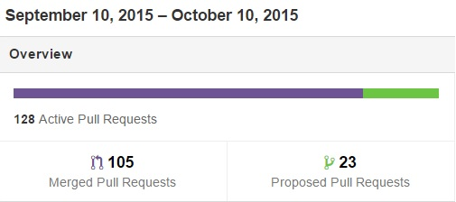
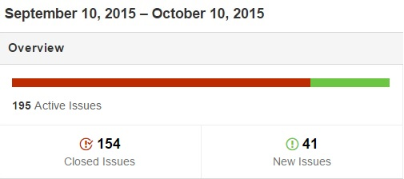

# Relatório 2 - ESOF
## Facebook/React - Gestão de Requisitos

### Levantamento de Requisitos

Antes de se iniciar a discussão acerca da gestão de requisitos num projeto como o React, é necessário perceber claramente o contexto de desenvolvimento *open-source* em que o mesmo se enquadra. Os conceitos estudados nas aulas teóricas da Unidade Curricular de Engenharia de Software dizem respeito a projetos de *software* proprietário. Nesse sentido, esses conceitos aplicam-se apenas em parte a um projeto comunitário e sem fins lucrativos como é o React.

Na fase em que o projeto se encontra, os novos requisitos são determinados pela lista de *issues* levantados pela comunidade, assim como pelos *pull requests* que os colaboradores podem submeter para apreciação da *core team*, conforme discutido no [Relatório 1](./Relatorio_1.md). Não existe uma definição clara dos requisitos futuros, mas apenas um direcionamento e validação das sugestões supramencionadas com vista à sua integração na biblioteca, sem comprometer a estabilidade do projeto a longo prazo. Importa, no entanto, explorar a motivação por parte do Facebook em desenvolver o React, descrevendo, em seguida, os seus casos de uso típicos e apresentando alguns requisitos próprios do React que o diferenciam de outras bibliotecas de JavaScript, nomeadamente a criação de *single-page applications* e isomorfismo.

#### Motivação

A principal [motivação](http://reactjs.de/posts/react-tutorial) por trás do desenvolvimento da biblioteca React foi a vontade do Facebook em tornar o seu código *front-end*, isto é, o código que corre no lado do cliente, de uma compreensão e manutenção mais fáceis. Antes do aparecimento do React, visualizar o comportamento do código existente era um processo moroso. Certas partes do código eram tão complexas que apenas os membros de um dado grupo de colaboradores conseguiam tratá-las. Erros de sincronização eram muito frequentes, com perdas de mensagens na comunicação entre cliente e servidor.

O objetivo do React é, assim, possibilitar a escrita de código mais simples, definindo componentes que não estejam tão enredados e dependentes entre si, como acontecia anteriormente, diminuindo, assim, a complexidade de programação. Estes são, de uma forma geral, os requisitos não funcionais do React, que se assume como uma solução aos problemas encontrados no desenvolvimento de *single-page applications*.

#### Casos de Uso

O diagrama seguinte mostra os casos de uso típicos do React, descrevendo, de forma geral, os requisitos funcionais desta biblioteca.

O React é usado por sistemas que integrem interfaces gráficas para o utilizador. Estes sistemas fazem, portanto, parte do grupo de [*stakeholders*](https://en.wikipedia.org/wiki/Project_stakeholder) do projeto. Os sistemas devem poder incluir a biblioteca com o objetivo principal de criar uma Vista para interação com o utiizador. A criação de uma Vista envolve a criação de [elementos](https://facebook.github.io/react/docs/component-api.html) da mesma, os quais podem ser *tags* de HTML ou de tipos (classes) definidos pelo programador. Uma classe pode ser definida estendendo a classe [React.Component](https://facebook.github.io/react/docs/component-api.html), usando a [sintaxe ES6](https://facebook.github.io/react/docs/reusable-components.html#es6-classes), ou recorrendo ao *wrapper* especial [React.createClass](https://facebook.github.io/react/docs/top-level-api.html#react.createclass). É, ainda, possível realizar a [validação dos tipos de dados](https://facebook.github.io/react/docs/reusable-components.html#prop-validation) que cada elemento recebe durante a execução da aplicação.

Ao criar elementos a partir de *tags* HTML, isto é, componentes do *Document Object Model* (DOM), podem ser usados *wrappers* especiais definidos pela classe [React.DOM](https://facebook.github.io/react/docs/top-level-api.html#react.dom). Esta funcionalidade do React é de particular relevância, pois constitui um dos princípios fundamentais desta biblioteca, contribuindo para uma maior facilidade no desenvolvimento das chamadas *single-page applications*.

#### *Single-Page Applications*

Uma [*single-page application*](https://en.wikipedia.org/wiki/Single-page_application) é uma aplicação Web que corre numa única página, conforme explicado no [Relatório 1](./Relatorio_1.md#descricao). A biblioteca React confere maior facilidade no desenvolvimento deste tipo de aplicações, cujo objetivo é fornecer uma experiência semelhante à de aplicações *desktop*, ou recebendo todo o código necessário à sua execução num único carregamento, ou carregando os recursos necessários de forma dinâmica, em resposta a ações do utilizador. A página não é recarregada durante todo o processo. A interação com uma aplicação deste tipo envolve comunicação dinâmica com o servidor Web.

#### Isomorfismo (*Server-Side Rendering*)

Outro requisito do React é permitir o [*rendering* da aplicação no lado do servidor](https://www.terlici.com/2015/03/18/fast-react-loading-server-rendering.html), um conceito conhecido como isomorfismo. Em vez de enviar uma grande quantidade de código JavaScript para a aplicação cliente, o próprio servidor tem a capacidade de realizar o [*rendering* da árvore DOM](http://www.pathinteractive.com/blog/design-development/rendering-a-webpage-with-google-webmaster-tools/) da página, enviando apenas código HTML. No lado do cliente, apenas é necessário juntar os *event handlers* necessários, o que torna o carregamento inicial da página mais rápido. Para que o resultado destas operações seja uma página dinâmica e com bom tempo de resposta, é necessário que a árvore DOM seja atualizada nos momentos certos. O React implementa algoritmos muito eficientes que permitem que a aplicação realize alterações à árvore DOM da página num número mínimo de passos, recorrendo a [heurísticas](http://facebook.github.io/react/docs/reconciliation.html) que, não garantindo uma solução ótima, garantem soluções muito rápidas para quase todos os casos de uso.

### Análise e Negociação

Como já foi mencionado na secção anterior, a principal fonte de requisitos provém da lista de *issues* e de *pull requests* exitente no GitHub, povoada através da contribuição quer da própria *core-team*, quer dos elementos externos a ela. Isto é, qualquer colaborador pode sugerir alterações a certas partes do projecto (relatando, por exemplo, *bug reports*, ou a solicitação de *feature requests*, noções estas que serão esclarecidas mais posteriormente) e até solicitar a integração das alterações ao código, realizando, para tal, um *pull request*. 
Perante esta volatibilidade dos requisitos, é necessário prodecer a uma análise prévia ao pedidos realizados, garantindo a exclusão da existência de conflitos entre os vários requisitos propostos, bem como no código (impedir, por exemplo, a existência de código redundante). Desta forma, a *core-team* fica encarregue de analisar as várias contribuições e determinar se são relevantes o suficiente para serem incorporadas no projecto. Note-se, contudo, que, mesmo após efectuada a análise, e se verificar que a contribuição tem a expressividade necessária para o projecto, é preciso proceder à execução de testes ao código submetido pelo colaborador usando a ferramenta [Travis CI](https://travis-ci.org/facebook/react/branches), componente esta que será abordada na secção de [Validação](#validacao).
Por forma a tornar claro o papel da *core-team* neste processo, o documento [Contributing to React](https://github.com/rppc/react/blob/master/CONTRIBUTING.md) define, entre outros assuntos, que o processo de análise fica ao cargo da mesma equipa:

> [Pull Requests](https://github.com/facebook/react/blob/master/CONTRIBUTING.md#pull-requests): The core team will be monitoring for pull requests. (...)

> [Where to Find Known Issues](https://github.com/facebook/react/blob/master/CONTRIBUTING.md#where-to-find-known-issues): We will be using GitHub Issues for our public bugs. We will keep a close eye on this and try to make it clear when we have an internal fix in progress.

Dada a quantidade de requisitos propostos, é essencial a implementação de um sistema de organização dos *issues* e dos *pull requests*. Para tal, é usado o sistema de etiquetas e de *milestones*, disponibilizado pelo GitHub, por forma a classificar os vários requisitos. Desta forma, o estabelecimento de prioridades é realizado, o que permite delinear, com maior claridade, o rumo que o projecto poderá tomar. Contudo, antes de ser feita esta classificação, é crucial chegar a um acordo acerca dos requisitos propostos. Assim, a *core-team* procede à realização de várias reuniões entre os seus elementos, onde traça, a curto prazo, a orientação que o projecto terá.

Apenas para efeitos de clarificação, assinale-se que os *issues* e os *pull requests* podem expressar *bug reports*, isto é, correcções a serem realizadas no projecto por forma a colmatar os múltiplos erros que possam surgir no decorrer da utilização do React, ou *features requests*, ou seja, a descrição e, possivelmente, posterior implementação de determinadas características que levam ao melhoramento do projecto em geral. Contudo, não existe uma distinção clara entre estes dois últimos conceitos, tomando-os, assim, como equivalentes. Isto é, ambos descrevem alterações que podem ser efectuadas ao projecto, em geral.

Note-se, contudo, que, no conjunto de requisitos disponíveis, podem subsistir alguns que, tendo em conta o paradigma actual, não são viáveis, devendo, nessas situações, proceder-se a uma negociação e eventual esclarecimento. Para tal, pode ser utilizada a seccção de conversação, existente em cada *issue* ou *pull request*, como se constata no [issue #5179](https://github.com/facebook/react/pull/5179), onde um dado colaborador procedeu a modificações na sintaxe de importação, por questões de simplificação; todavia, tal sugestão foi rejeitada em prol da minimização de conteúdos a reter pelos utilizadores da biblioteca React.

### Especificação

Após a análise (e possível negociação) dos vários requisitos, é necessário estabelecer o rumo que o projecto tomará nos próximos tempos. 
Assim, a *core-team* procede à realização de várias reuniões entre os seus elementos de tempos a tempos (assunto este que já foi abordado no relatório anterior), de maneira a consolidar os requisitos do projecto. Nessas reuniões, entre outros temas, é abordado o planeamento dos vários *milestones*, como se constata na [Meeting Notes 2015-05-15](https://discuss.reactjs.org/t/meeting-notes-2015-05-15/362). 
Um *milestone* é utilizado para agrupar *issues* e *pull requests* semelhantes, que normalmente têm um *deadline* associado. Note-se, contudo, neste projecto, a componente de *deadline* não é utilizado, como se comprova na secção de [milestones](https://github.com/facebook/react/milestones). Em adição das reuniões, outros colaboradores, por iniciativa própria, podem proceder à realização de documentação relativamente à biblioteca React. 
Por exemplo, o utilizador [jamesknelson](https://discuss.reactjs.org/t/react-cheatsheet-for-0-14/1979) concebeu uma documentação onde expressa, principalmente, a componente funcional da mesma biblioteca, por forma a auxiliar ao desenvolvimento de aplicações que usam o React.

### Validação de Requisitos

Este processo de validação de requisitos trata, tal como o nome indica , de validar quanto à consistência, precisão e contextualização dos requisitos levantados nos processos de [Levantamento de Requisitos](#levantamento) e [Análise e Negociação](#analise). É necessário demonstrar que os requisitos definem o sistema que o cliente realmente deseja.

Aplicando este processo ao **React**, não existe o conceito de clientes que deve validar os requisitos, pelo contrário, a *core-team* do projeto é a responsável pela validação, sendo eles, a um certo nível, os *stakeholders*. 

Ao nível da validação para o **React** podemos considerar as *issues* e os *pull requests*.

Como demonstra a figura abaixo relativa aos *pull request* recebidos no último mês, à data deste relatório, somos confrontados com 128 pedidos ativos, tendo 105 já aprovados e os restantes ainda em avaliação.

Inicialmente, os *pull request* são testados automaticamente, de forma a verificar se estão dentro dos requisitos exigidos, através da ferramenta **Travis IC** disponível no sítio [travis-ci.org](https://travis-ci.org/). Esta ferramenta, um serviço *hosted continuous integration* para projetos *open source* e privados, executa testes de compilação e regista o sucesso ou não dos testes. A resposta da ferramenta **Travis IC** não é decisiva quanto à aceitação do *source code*, cabendo a decisão final à *core-team*, porque mesmo que reprove nos testes, o *pull request* pode ser adicionado ao projeto. Esta ferramenta é uma mais valia para os colaboradores devido à grande densidade de solicitações de alterações que o projeto recebe. 

O projeto **React** precisa também de validar o elevado número de *issues* que recebe, estando o último mês descriminado na seguinte imagem.

A *core-team* utiliza o método de etiquetação das *issues*, por forma a atribuir diferentes significados/intenções aos *issues* e também para efeitos de organização. Caso se constate que um *issue* possui uma ideia interessante, é marcado como *good first bug* pela *core-team*, atribuíndo, desta forma, uma prioridade à resolução do *issue*.

É de realçar a importância que a *core team* dá para a organização do código. São mais de cinco centenas de colaboradores e cinco milhares de *commits*, à presente data deste relatório, que tornam a sua gestão custosa. E, caso se consiga corrigir erros previamente, evitar-se-á elevados custos no futuro devido à elevada dimensão do projeto, como referido.

Como se pode constatar, todos os requisitos expostos pela comunidade são escrutinados pela *core-team* por forma a determinar quais possuem prioridade e que contribuem significativamente para o resultado final do projecto.

#### Técnicas ~~ Por corrigir/completar: Amaral ~~

Existem várias técnicas relativas a validação de requesitos, sendo que algumas delas foram estudadas nas aulas teóricas, tais como: 

-Requirements reviews and inspections
-Prototyping
-Model validation
-Acceptance test case generation.

Tendo em conta as opções listadas, o projeto React demonstra poucas evidências de uso das mesmas. A mais clara delas todas é mesmo o *prototyping*, dado que cada colaborador possui o seu fork.
Através dos forks, os seus contribuidor podem fazer e testar as alterações desenvolvidas por si, como por exemplo uma *issue*, num programa à parte do principal. Depois de realizados todos os testes, esta nova versão poderá ser acoplada ao repositório principal atrás de um *pull request*. 

### Conclusão

Este projeto apresenta um conceito de validação de recursos oposto ao esperado e estudado. Neste caso, não é a *core team* que procura os colaboradores e diz que *features* gostavam que fossem implementadas. São os colaboradores que desenvolvem as funcionalidades que acham que melhorariam o projeto e, só depois, fazem *pull request*. Após este passo, estas novas alterações são analisadas pelos responsáveis do projeto e caso sejam melhorias úteis para o projeto final, são introduzidas no repositório principal.

### Informações

##### Autores:

* António Casimiro (antonio.casimiro@fe.up.pt)
* Diogo Amaral (diogo.amaral@fe.up.pt)
* Pedro Silva (pedro.silva@fe.up.pt)
* Rui Cardoso (rui.peixoto@fe.up.pt)

Faculdade de Engenharia da Universidade do Porto - MIEIC

2015-10-18
