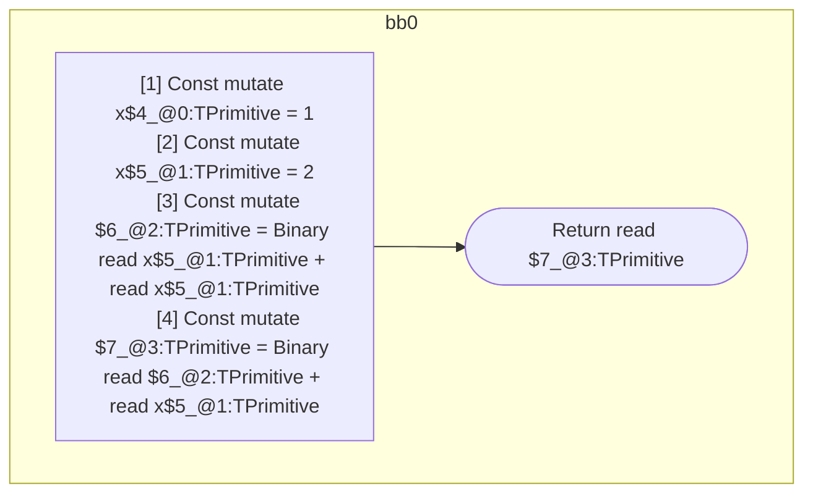

## Input

```javascript
function f() {
  let x = 1;
  // BUG: `x` has different values within this expression. Currently, the
  // assignment is evaluated too early.
  return x + (x = 2) + x;
}

```

## HIR

```
bb0:
  [1] Const mutate x$4_@0:TPrimitive = 1
  [2] Const mutate x$5_@1:TPrimitive = 2
  [3] Const mutate $6_@2:TPrimitive = Binary read x$5_@1:TPrimitive + read x$5_@1:TPrimitive
  [4] Const mutate $7_@3:TPrimitive = Binary read $6_@2:TPrimitive + read x$5_@1:TPrimitive
  [5] Return read $7_@3:TPrimitive
scope2 [3:4]:
  - dependency: read x$5_@1:TPrimitive
  - dependency: read x$5_@1:TPrimitive
scope3 [4:5]:
  - dependency: read $6_@2:TPrimitive
  - dependency: read x$5_@1:TPrimitive
```

## Reactive Scopes

```
function f(
) {
  [1] Const mutate x$4_@0:TPrimitive = 1
  [2] Const mutate x$5_@1:TPrimitive = 2
  [3] Const mutate $6_@2:TPrimitive = Binary read x$5_@1:TPrimitive + read x$5_@1:TPrimitive
  [4] Const mutate $7_@3:TPrimitive = Binary read $6_@2:TPrimitive + read x$5_@1:TPrimitive
  return read $7_@3:TPrimitive
}

```

### CFG



## Code

```javascript
function f$0() {
  const x$4 = 1;
  const x$5 = 2;
  return x$5 + x$5 + x$5;
}

```
      