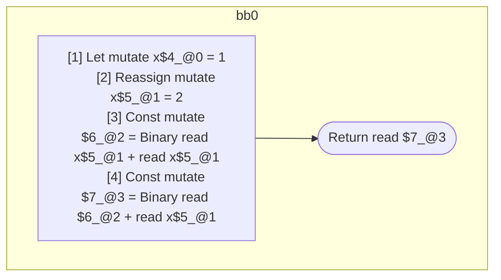

## Input

```javascript
function f() {
  let x = 1;
  // BUG: `x` has different values within this expression. Currently, the
  // assignment is evaluated too early.
  return x + (x = 2) + x;
}

```

## HIR

```
bb0:
  [1] Let mutate x$4_@0 = 1
  [2] Reassign mutate x$5_@1 = 2
  [3] Const mutate $6_@2 = Binary read x$5_@1 + read x$5_@1
  [4] Const mutate $7_@3 = Binary read $6_@2 + read x$5_@1
  [5] Return read $7_@3
scope2 [3:4]:
 - read x$5_@1
 - read x$5_@1
scope3 [4:5]:
 - read $6_@2
 - read x$5_@1
```

### CFG



## Code

```javascript
function f$0() {
  const x$4 = 1;
  const x$5 = 2;
  return x$5 + x$5 + x$5;
}

```
      