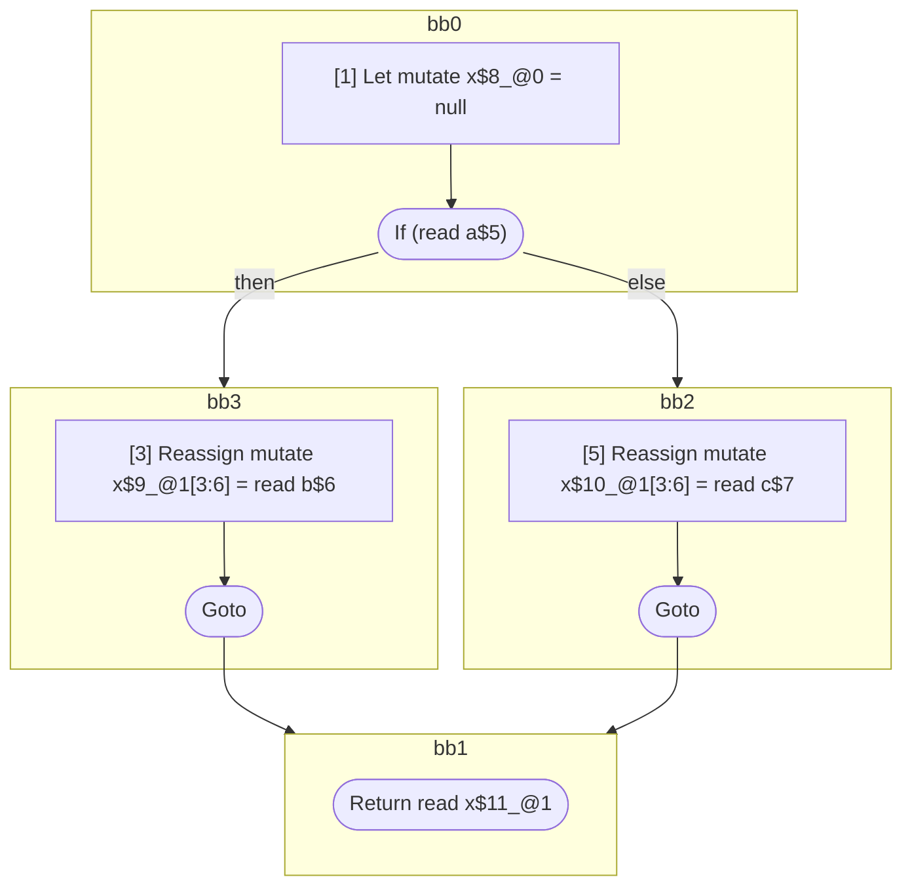

## Input

```javascript
function foo(a, b, c) {
  let x = null;
  label: {
    if (a) {
      x = b;
      break label;
    }
    x = c;
  }
  return x;
}

```

## HIR

```
bb0:
  [1] Let mutate x$8_@0 = null
  [2] If (read a$5) then:bb3 else:bb2 fallthrough=bb2
bb3:
  predecessor blocks: bb0
  [3] Reassign mutate x$9_@1[3:6] = read b$6
  [4] Goto bb1
bb2:
  predecessor blocks: bb0
  [5] Reassign mutate x$10_@1[3:6] = read c$7
  [6] Goto bb1
bb1:
  predecessor blocks: bb3 bb2
  x$11_@1[3:6]: phi(bb3: x$9_@1, bb2: x$10_@1)
  [7] Return read x$11_@1
scope1 [3:6]:
 - read b$6
 - read a$5
 - read c$7
```

### CFG



## Code

```javascript
function foo$0(a$5, b$6, c$7) {
  const x$8 = null;
  bb2: if (a$5) {
    const x$9 = b$6;
  }

  const x$10 = c$7;
}

```
      