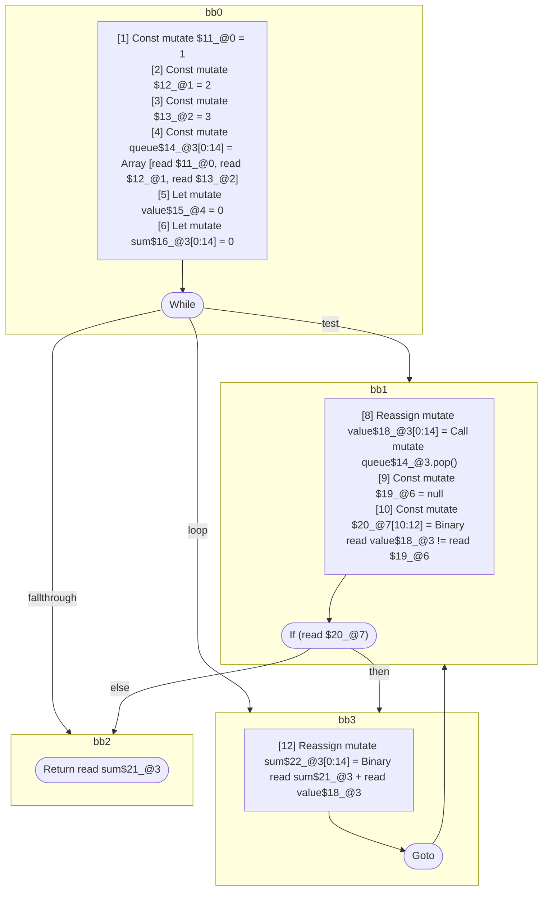

## Input

```javascript
function f(reader) {
  const queue = [1, 2, 3];
  let value = 0;
  let sum = 0;
  // BUG: we need to codegen the complex test expression
  while ((value = queue.pop()) != null) {
    sum += value;
  }
  return sum;
}

```

## HIR

```
bb0:
  [1] Const mutate $11_@0 = 1
  [2] Const mutate $12_@1 = 2
  [3] Const mutate $13_@2 = 3
  [4] Const mutate queue$14_@3[0:14] = Array [read $11_@0, read $12_@1, read $13_@2]
  [5] Let mutate value$15_@4 = 0
  [6] Let mutate sum$16_@3[0:14] = 0
  [7] While test=bb1 loop=bb3 fallthrough=bb2
bb1:
  predecessor blocks: bb0 bb3
  sum$21_@3[0:14]: phi(bb0: sum$16_@3, bb3: sum$22_@3)
  [8] Reassign mutate value$18_@3[0:14] = Call mutate queue$14_@3.pop()
  [9] Const mutate $19_@6 = null
  [10] Const mutate $20_@7[10:12] = Binary read value$18_@3 != read $19_@6
  [11] If (read $20_@7) then:bb3 else:bb2
bb3:
  predecessor blocks: bb1
  [12] Reassign mutate sum$22_@3[0:14] = Binary read sum$21_@3 + read value$18_@3
  [13] Goto(Continue) bb1
bb2:
  predecessor blocks: bb1
  [14] Return read sum$21_@3
scope7 [10:12]:
 - read $19_@6
```

### CFG



## Code

```javascript
function f$0(reader$1) {
  const queue$2 = [1, 2, 3];
  let value$6 = 0;
  let sum$7 = 0;
  bb2: while (((value$6 = queue$2.pop()), value$6 != null)) {
    sum$7 = sum$7 + value$6;
  }

  return sum$7;
}

```
      