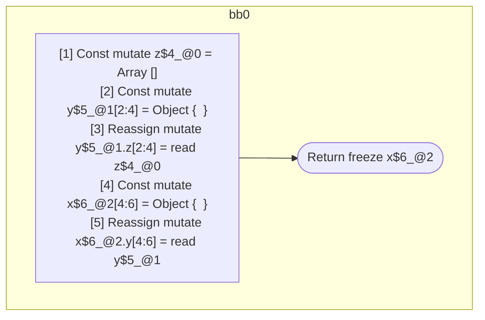

## Input

```javascript
function component() {
  let z = [];
  let y = {};
  y.z = z;
  let x = {};
  x.y = y;
  return x;
}

```

## HIR

```
bb0:
  [1] Const mutate z$4_@0 = Array []
  [2] Const mutate y$5_@1[2:4] = Object {  }
  [3] Reassign mutate y$5_@1.z[2:4] = read z$4_@0
  [4] Const mutate x$6_@2[4:6] = Object {  }
  [5] Reassign mutate x$6_@2.y[4:6] = read y$5_@1
  [6] Return freeze x$6_@2
scope1 [2:4]:
  - dependency: read z$4_@0
scope2 [4:6]:
  - dependency: read y$5_@1
```

### CFG



## Code

```javascript
function component$0() {
  const z$4 = [];
  const y$5 = {};
  y$5.z = z$4;
  const x$6 = {};
  x$6.y = y$5;
  return x$6;
}

```
      