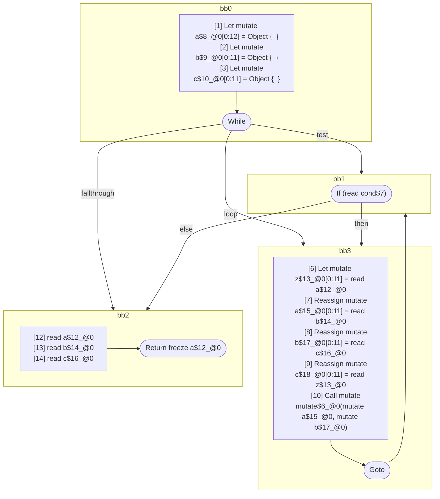
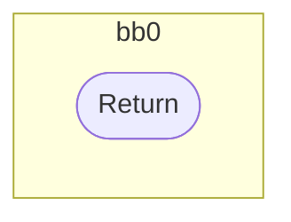

## Input

```javascript
function foo(cond) {
  let a = {};
  let b = {};
  let c = {};
  while (cond) {
    let z = a;
    a = b;
    b = c;
    c = z;
    mutate(a, b);
  }
  a;
  b;
  c;
  return a;
}

function mutate(x, y) {}

```

## HIR

```
bb0:
  [1] Let mutate a$8_@0[0:12] = Object {  }
  [2] Let mutate b$9_@0[0:11] = Object {  }
  [3] Let mutate c$10_@0[0:11] = Object {  }
  [4] While test=bb1 loop=bb3 fallthrough=bb2
bb1:
  predecessor blocks: bb0 bb3
  a$12_@0[0:11]: phi(bb0: a$8_@0, bb3: a$15_@0)
  b$14_@0[0:11]: phi(bb0: b$9_@0, bb3: b$17_@0)
  c$16_@0[0:11]: phi(bb0: c$10_@0, bb3: c$18_@0)
  [5] If (read cond$7) then:bb3 else:bb2
bb3:
  predecessor blocks: bb1
  [6] Let mutate z$13_@0[0:11] = read a$12_@0
  [7] Reassign mutate a$15_@0[0:11] = read b$14_@0
  [8] Reassign mutate b$17_@0[0:11] = read c$16_@0
  [9] Reassign mutate c$18_@0[0:11] = read z$13_@0
  [10] Call mutate mutate$6_@0(mutate a$15_@0, mutate b$17_@0)
  [11] Goto(Continue) bb1
bb2:
  predecessor blocks: bb1
  [12] read a$12_@0
  [13] read b$14_@0
  [14] read c$16_@0
  [15] Return freeze a$12_@0
```

### CFG



## Code

```javascript
function foo$0(cond$1) {
  let a$2 = {};
  let b$3 = {};
  let c$4 = {};
  bb2: while (cond$1) {
    let z$5 = a$2;
    a$2 = b$3;
    b$3 = c$4;
    c$4 = z$5;
    mutate$6(a$2, b$3);
  }

  a$2;
  b$3;
  c$4;
  return a$2;
}

```
## HIR

```
bb0:
  [1] Return
```

### CFG



## Code

```javascript
function mutate$0(x$1, y$2) {}

```
      