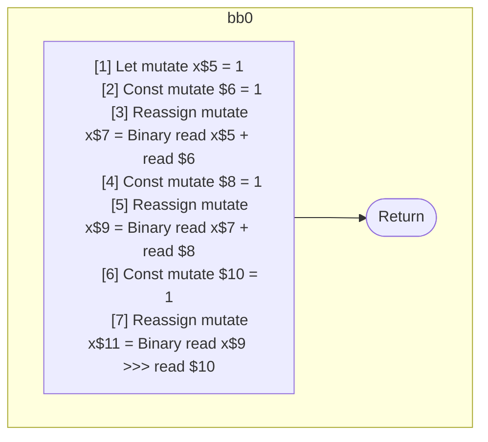
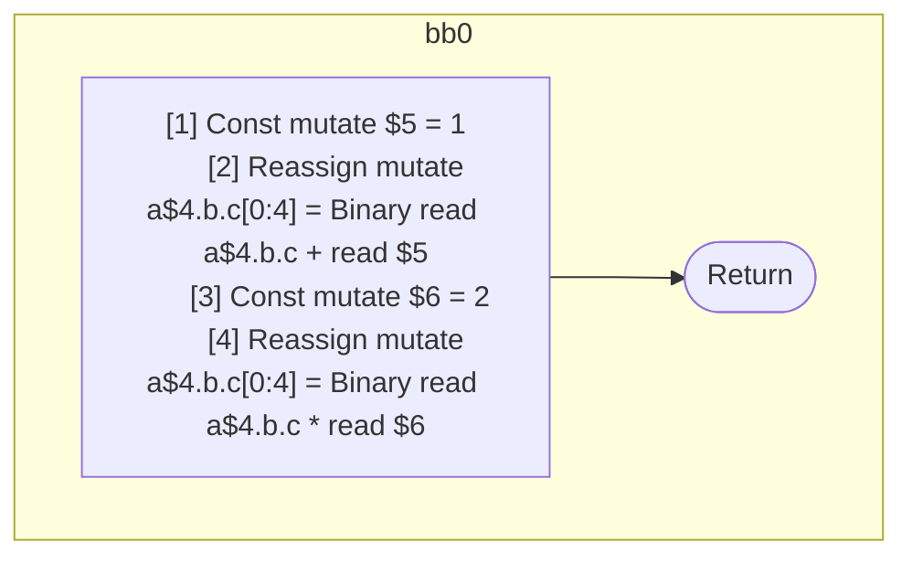

## Input

```javascript
function f() {
  let x = 1;
  x = x + 1;
  x += 1;
  x >>>= 1;
}

function g(a) {
  a.b.c = a.b.c + 1;
  a.b.c *= 2;
}

```

## HIR

```
bb0:
  [1] Let mutate x$5 = 1
  [2] Const mutate $6 = 1
  [3] Reassign mutate x$7 = Binary read x$5 + read $6
  [4] Const mutate $8 = 1
  [5] Reassign mutate x$9 = Binary read x$7 + read $8
  [6] Const mutate $10 = 1
  [7] Reassign mutate x$11 = Binary read x$9 >>> read $10
  Return
```

### CFG



## Code

```javascript
function f$0() {
  let x$5 = 1;
  x$7 = x$5 + 1;
  x$9 = x$7 + 1;
  x$11 = x$9 >>> 1;
  return;
}

```
## HIR

```
bb0:
  [1] Const mutate $5 = 1
  [2] Reassign mutate a$4.b.c[0:4] = Binary read a$4.b.c + read $5
  [3] Const mutate $6 = 2
  [4] Reassign mutate a$4.b.c[0:4] = Binary read a$4.b.c * read $6
  Return
```

### CFG



## Code

```javascript
function g$0(a$4) {
  a$4.c.b = a$4.b.c + 1;
  a$4.c.b = a$4.b.c * 2;
  return;
}

```
      