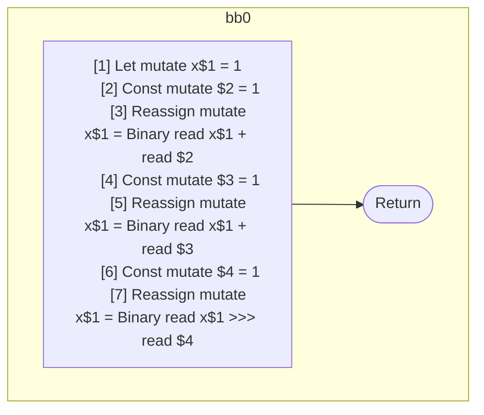
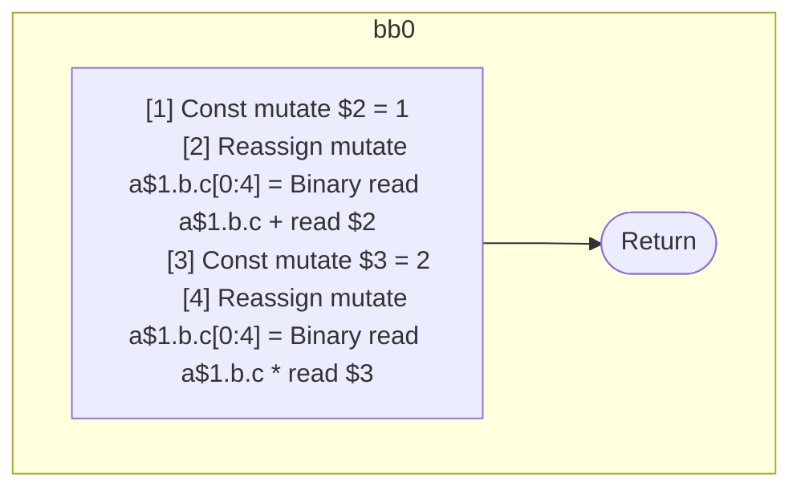

## Input

```javascript
function f() {
  let x = 1;
  x = x + 1;
  x += 1;
  x >>>= 1;
}

function g(a) {
  a.b.c = a.b.c + 1;
  a.b.c *= 2;
}

```

## HIR

```
bb0:
  [1] Let mutate x$1 = 1
  [2] Const mutate $2 = 1
  [3] Reassign mutate x$1 = Binary read x$1 + read $2
  [4] Const mutate $3 = 1
  [5] Reassign mutate x$1 = Binary read x$1 + read $3
  [6] Const mutate $4 = 1
  [7] Reassign mutate x$1 = Binary read x$1 >>> read $4
  Return
```

### CFG



## Code

```javascript
function f$0() {
  let x$1 = 1;
  x$1 = x$1 + 1;
  x$1 = x$1 + 1;
  x$1 = x$1 >>> 1;
  return;
}

```
## HIR

```
bb0:
  [1] Const mutate $2 = 1
  [2] Reassign mutate a$1.b.c[0:4] = Binary read a$1.b.c + read $2
  [3] Const mutate $3 = 2
  [4] Reassign mutate a$1.b.c[0:4] = Binary read a$1.b.c * read $3
  Return
```

### CFG



## Code

```javascript
function g$0(a$1) {
  a$1.c.b = a$1.b.c + 1;
  a$1.c.b = a$1.b.c * 2;
  return;
}

```
      