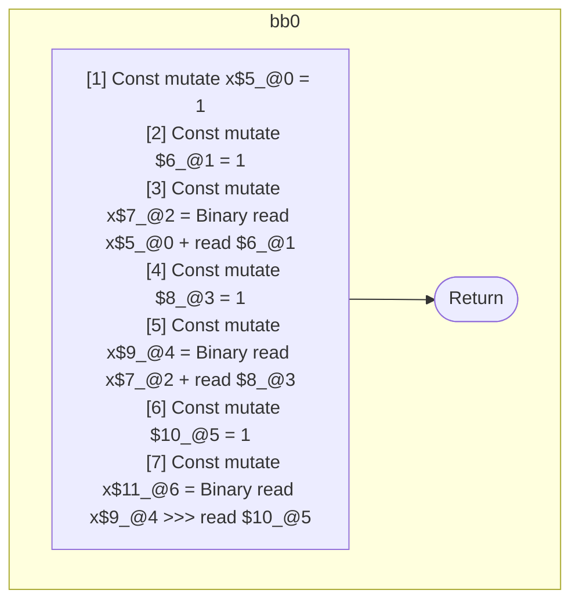
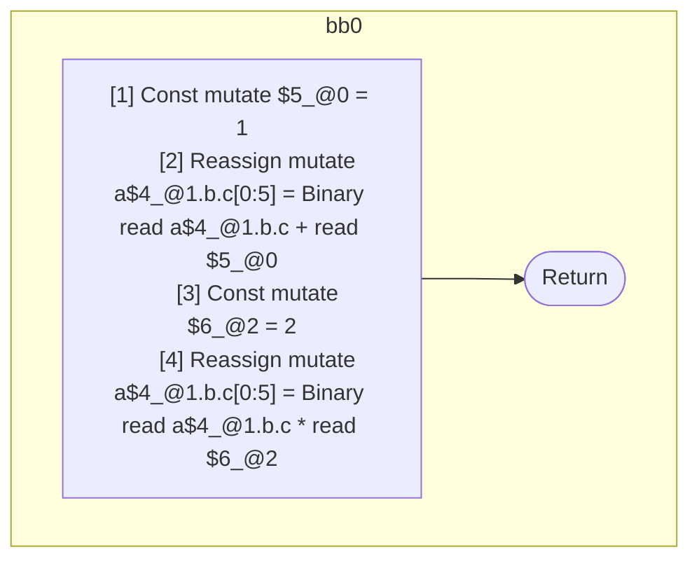

## Input

```javascript
function f() {
  let x = 1;
  x = x + 1;
  x += 1;
  x >>>= 1;
}

function g(a) {
  a.b.c = a.b.c + 1;
  a.b.c *= 2;
}

```

## HIR

```
bb0:
  [1] Const mutate x$5_@0 = 1
  [2] Const mutate $6_@1 = 1
  [3] Const mutate x$7_@2 = Binary read x$5_@0 + read $6_@1
  [4] Const mutate $8_@3 = 1
  [5] Const mutate x$9_@4 = Binary read x$7_@2 + read $8_@3
  [6] Const mutate $10_@5 = 1
  [7] Const mutate x$11_@6 = Binary read x$9_@4 >>> read $10_@5
  [8] Return
scope2 [3:4]:
 - read x$5_@0
 - read $6_@1
scope4 [5:6]:
 - read x$7_@2
 - read $8_@3
scope6 [7:8]:
 - read x$9_@4
 - read $10_@5
```

### CFG



## Code

```javascript
function f$0() {
  const x$5 = 1;
  const x$7 = x$5 + 1;
  const x$9 = x$7 + 1;
  const x$11 = x$9 >>> 1;
}

```
## HIR

```
bb0:
  [1] Const mutate $5_@0 = 1
  [2] Reassign mutate a$4_@1.b.c[0:5] = Binary read a$4_@1.b.c + read $5_@0
  [3] Const mutate $6_@2 = 2
  [4] Reassign mutate a$4_@1.b.c[0:5] = Binary read a$4_@1.b.c * read $6_@2
  [5] Return
scope2 [3:4]:
 - mutate a$4_@1.b.c
```

### CFG



## Code

```javascript
function g$0(a$4) {
  a$4.c.b = a$4.b.c + 1;
  a$4.c.b = a$4.b.c * 2;
}

```
      