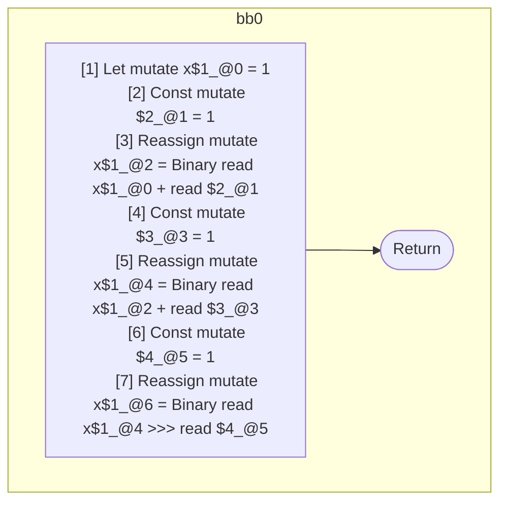

## Input

```javascript
function f() {
  let x = 1;
  x = x + 1;
  x += 1;
  x >>>= 1;
}

function g(a) {
  a.b.c = a.b.c + 1;
  a.b.c *= 2;
}

```

## HIR

```
bb0:
  [1] Let mutate x$1_@0 = 1
  [2] Const mutate $2_@1 = 1
  [3] Reassign mutate x$1_@2 = Binary read x$1_@0 + read $2_@1
  [4] Const mutate $3_@3 = 1
  [5] Reassign mutate x$1_@4 = Binary read x$1_@2 + read $3_@3
  [6] Const mutate $4_@5 = 1
  [7] Reassign mutate x$1_@6 = Binary read x$1_@4 >>> read $4_@5
  [8] Return
```

### CFG



## Code

```javascript
function f$0() {
  let x$1 = 1;
  x$1 = x$1 + 1;
  x$1 = x$1 + 1;
  x$1 = x$1 >>> 1;
}

```
## HIR

```
bb0:
  [1] Const mutate $2_@0 = 1
  [2] Reassign mutate a$1_@1.b.c[0:5] = Binary read a$1_@1.b.c + read $2_@0
  [3] Const mutate $3_@2 = 2
  [4] Reassign mutate a$1_@1.b.c[0:5] = Binary read a$1_@1.b.c * read $3_@2
  [5] Return
```

### CFG


## Code

```javascript
function g$0(a$1) {
  a$1.c.b = a$1.b.c + 1;
  a$1.c.b = a$1.b.c * 2;
}

```
      