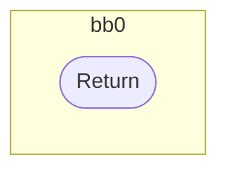
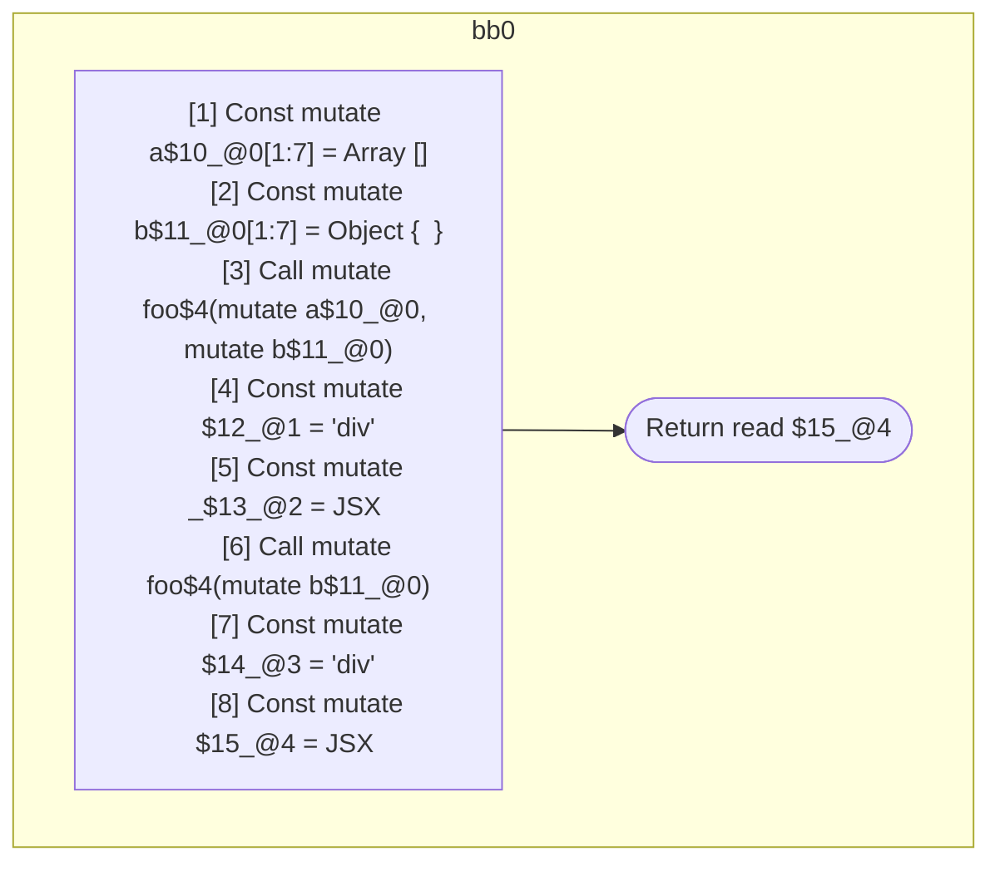

## Input

```javascript
function foo() {}

function Component(props) {
  const a = [];
  const b = {};
  foo(a, b);
  let _ = <div a={a} />;
  foo(b);
  return <div a={a} b={b} />;
}

```

## HIR

```
bb0:
  [1] Return

```

## Reactive Scopes

```
function foo(
) {
  return
}

```

### CFG



## Code

```javascript
function foo$0() {}

```
## HIR

```
bb0:
  [1] Const mutate a$10_@0[1:7] = Array []
  [2] Const mutate b$11_@0[1:7] = Object {  }
  [3] Call mutate foo$4(mutate a$10_@0, mutate b$11_@0)
  [4] Const mutate $12_@1 = "div"
  [5] Const mutate _$13_@2 = JSX <read $12_@1 a={freeze a$10_@0} ></read $12_@1>
  [6] Call mutate foo$4(mutate b$11_@0)
  [7] Const mutate $14_@3 = "div"
  [8] Const mutate $15_@4 = JSX <read $14_@3 a={read a$10_@0} b={freeze b$11_@0} ></read $14_@3>
  [9] Return read $15_@4
scope2 [5:6]:
  - dependency: read $12_@1
scope4 [8:9]:
  - dependency: read $14_@3
  - dependency: read a$10_@0
  - dependency: freeze b$11_@0
```

## Reactive Scopes

```
function Component(
  props,
) {
  scope @0 [1:7] deps=[] {
    [1] Const mutate a$10_@0[1:7] = Array []
    [2] Const mutate b$11_@0[1:7] = Object {  }
    [3] Call mutate foo$4(mutate a$10_@0, mutate b$11_@0)
    [4] Const mutate $12_@1 = "div"
    scope @2 [5:6] deps=[read $12_@1] {
      [5] Const mutate _$13_@2 = JSX <read $12_@1 a={freeze a$10_@0} ></read $12_@1>
    }
    [6] Call mutate foo$4(mutate b$11_@0)
  }
  [7] Const mutate $14_@3 = "div"
  scope @4 [8:9] deps=[read $14_@3, read a$10_@0, freeze b$11_@0] {
    [8] Const mutate $15_@4 = JSX <read $14_@3 a={read a$10_@0} b={freeze b$11_@0} ></read $14_@3>
  }
  return read $15_@4
}

```

### CFG



## Code

```javascript
function Component$0(props$9) {
  const a$10 = [];
  const b$11 = {};
  foo$4(a$10, b$11);
  const _$13 = <div a={a$10}></div>;

  foo$4(b$11);
  return <div a={a$10} b={b$11}></div>;
}

```
      