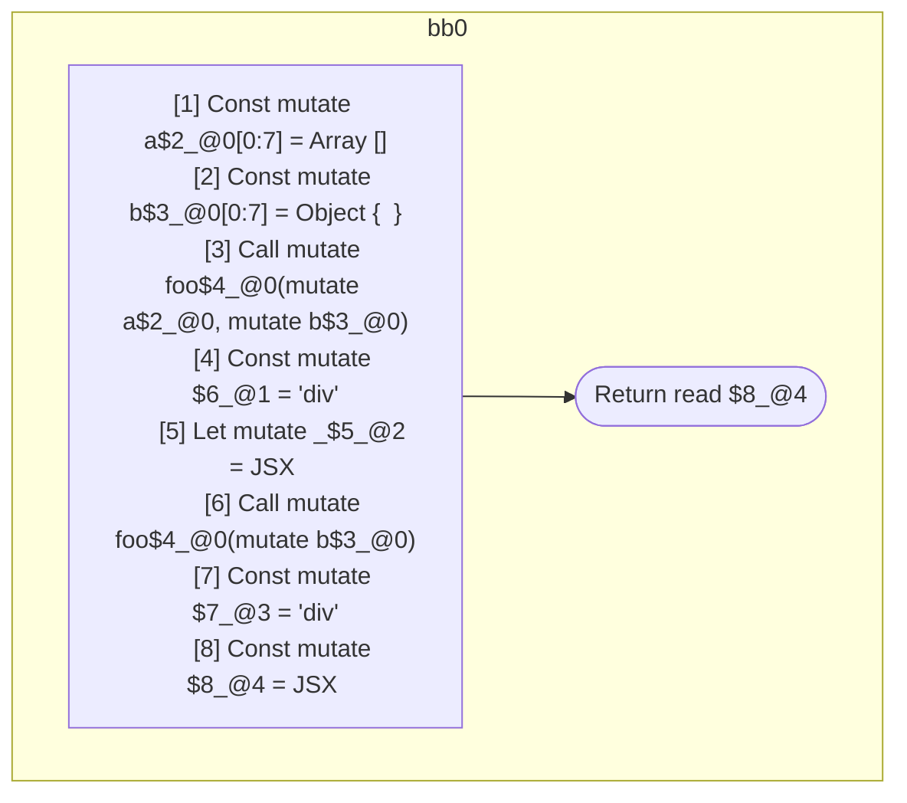

## Input

```javascript
function foo() {}

function Component(props) {
  const a = [];
  const b = {};
  foo(a, b);
  let _ = <div a={a} />;
  foo(b);
  return <div a={a} b={b} />;
}

```

## HIR

```
bb0:
  [1] Return
```

### CFG


## Code

```javascript
function foo$0() {}

```
## HIR

```
bb0:
  [1] Const mutate a$2_@0[0:7] = Array []
  [2] Const mutate b$3_@0[0:7] = Object {  }
  [3] Call mutate foo$4_@0(mutate a$2_@0, mutate b$3_@0)
  [4] Const mutate $6_@1 = "div"
  [5] Let mutate _$5_@2 = JSX <read $6_@1 a={freeze a$2_@0} ></read $6_@1>
  [6] Call mutate foo$4_@0(mutate b$3_@0)
  [7] Const mutate $7_@3 = "div"
  [8] Const mutate $8_@4 = JSX <read $7_@3 a={read a$2_@0} b={freeze b$3_@0} ></read $7_@3>
  [9] Return read $8_@4
```

### CFG



## Code

```javascript
function Component$0(props$1) {
  const a$2 = [];
  const b$3 = {};
  foo$4(a$2, b$3);
  let _$5 = <div a={a$2}></div>;

  foo$4(b$3);
  return <div a={a$2} b={b$3}></div>;
}

```
      