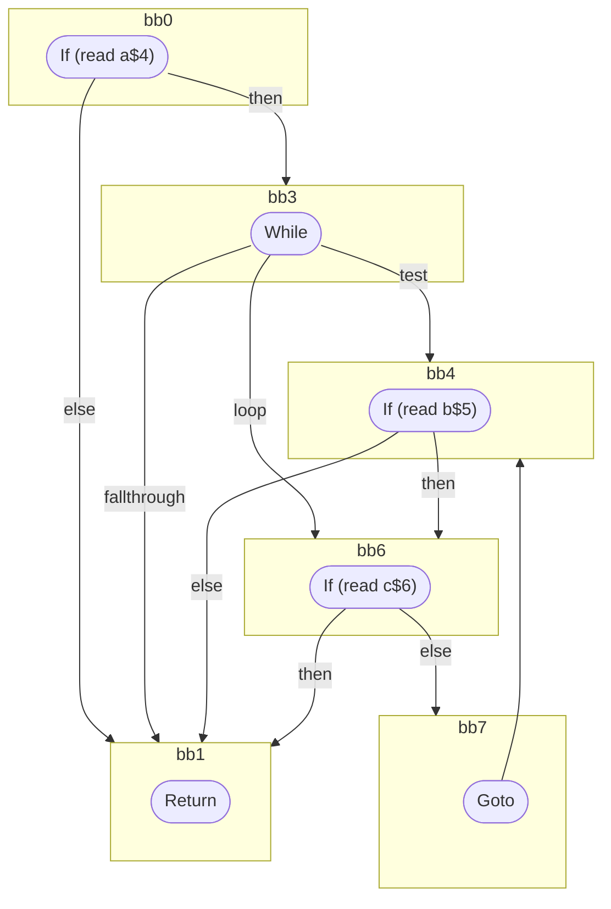

## Input

```javascript
function foo(a, b, c) {
  label: if (a) {
    while (b) {
      if (c) {
        break;
      }
    }
  }
}

```

## HIR

```
bb0:
  [1] If (read a$4) then:bb3 else:bb1
bb3:
  predecessor blocks: bb0
  [2] While test=bb4 loop=bb6 fallthrough=bb1
bb4:
  predecessor blocks: bb3 bb7
  [3] If (read b$5) then:bb6 else:bb1
bb6:
  predecessor blocks: bb4
  [4] If (read c$6) then:bb1 else:bb7
bb7:
  predecessor blocks: bb6
  [5] Goto(Continue) bb4
bb1:
  predecessor blocks: bb6 bb4 bb0
  [6] Return
```

### CFG



## Code

```javascript
function foo$0(a$1, b$2, c$3) {
  bb1: if (a$1) {
    while (b$2) {
      bb7: if (c$3) break;
    }
  }
}

```
      