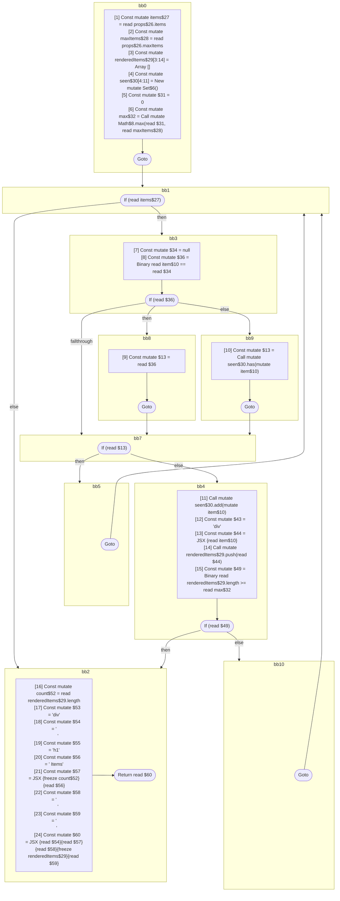

## Input

```javascript
// @Out DefUseGraph
function Component(props) {
  const items = props.items;
  const maxItems = props.maxItems;

  const renderedItems = [];
  const seen = new Set();
  const max = Math.max(0, maxItems);
  for (const item of items) {
    if (item == null || seen.has(item)) {
      continue;
    }
    seen.add(item);
    renderedItems.push(<div>{item}</div>);
    if (renderedItems.length >= max) {
      break;
    }
  }
  const count = renderedItems.length;
  return (
    <div>
      <h1>{count} Items</h1>
      {renderedItems}
    </div>
  );
}

```

## HIR

```
bb0:
  [1] Const mutate items$27 = read props$26.items
  [2] Const mutate maxItems$28 = read props$26.maxItems
  [3] Const mutate renderedItems$29[3:14] = Array []
  [4] Const mutate seen$30[4:11] = New mutate Set$6()
  [5] Const mutate $31 = 0
  [6] Const mutate max$32 = Call mutate Math$8.max(read $31, read maxItems$28)
  Goto bb1
bb1:
  predecessor blocks: bb0 bb5 bb10
  If (read items$27) then:bb3 else:bb2
bb3:
  predecessor blocks: bb1
  [7] Const mutate $34 = null
  [8] Const mutate $36 = Binary read item$10 == read $34
  If (read $36) then:bb8 else:bb9
bb8:
  predecessor blocks: bb3
  [9] Const mutate $13 = read $36
  Goto bb7
bb9:
  predecessor blocks: bb3
  [10] Const mutate $13 = Call mutate seen$30.has(mutate item$10)
  Goto bb7
bb7:
  predecessor blocks: bb8 bb9
  If (read $13) then:bb5 else:bb4
bb5:
  predecessor blocks: bb7
  Goto(Continue) bb1
bb4:
  predecessor blocks: bb7
  [11] Call mutate seen$30.add(mutate item$10)
  [12] Const mutate $43 = "div"
  [13] Const mutate $44 = JSX <read $43>{read item$10}</read $43>
  [14] Call mutate renderedItems$29.push(read $44)
  [15] Const mutate $49 = Binary read renderedItems$29.length >= read max$32
  If (read $49) then:bb2 else:bb10
bb10:
  predecessor blocks: bb4
  Goto(Continue) bb1
bb2:
  predecessor blocks: bb4 bb1
  [16] Const mutate count$52 = read renderedItems$29.length
  [17] Const mutate $53 = "div"
  [18] Const mutate $54 = "\n      "
  [19] Const mutate $55 = "h1"
  [20] Const mutate $56 = " Items"
  [21] Const mutate $57 = JSX <read $55>{freeze count$52}{read $56}</read $55>
  [22] Const mutate $58 = "\n      "
  [23] Const mutate $59 = "\n    "
  [24] Const mutate $60 = JSX <read $53>{read $54}{read $57}{read $58}{freeze renderedItems$29}{read $59}</read $53>
  Return read $60
```

### CFG



## Code

```javascript
function Component$0(props$26) {
  const items$27 = props$26.items;
  const maxItems$28 = props$26.maxItems;
  const renderedItems$29 = [];
  const seen$30 = new Set$6();
  const max$32 = Math$8.max(0, maxItems$28);
}

```
      