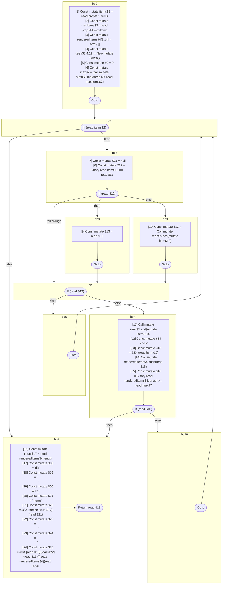

## Input

```javascript
// @Out DefUseGraph
function Component(props) {
  const items = props.items;
  const maxItems = props.maxItems;

  const renderedItems = [];
  const seen = new Set();
  const max = Math.max(0, maxItems);
  for (const item of items) {
    if (item == null || seen.has(item)) {
      continue;
    }
    seen.add(item);
    renderedItems.push(<div>{item}</div>);
    if (renderedItems.length >= max) {
      break;
    }
  }
  const count = renderedItems.length;
  return (
    <div>
      <h1>{count} Items</h1>
      {renderedItems}
    </div>
  );
}

```

## HIR

```
bb0:
  [1] Const mutate items$2 = read props$1.items
  [2] Const mutate maxItems$3 = read props$1.maxItems
  [3] Const mutate renderedItems$4[3:14] = Array []
  [4] Const mutate seen$5[4:11] = New mutate Set$6()
  [5] Const mutate $9 = 0
  [6] Const mutate max$7 = Call mutate Math$8.max(read $9, read maxItems$3)
  Goto bb1
bb1:
  predecessor blocks: bb0 bb5 bb10
  If (read items$2) then:bb3 else:bb2
bb3:
  predecessor blocks: bb1
  [7] Const mutate $11 = null
  [8] Const mutate $12 = Binary read item$10 == read $11
  If (read $12) then:bb8 else:bb9
bb8:
  predecessor blocks: bb3
  [9] Const mutate $13 = read $12
  Goto bb7
bb9:
  predecessor blocks: bb3
  [10] Const mutate $13 = Call mutate seen$5.has(mutate item$10)
  Goto bb7
bb7:
  predecessor blocks: bb8 bb9
  If (read $13) then:bb5 else:bb4
bb5:
  predecessor blocks: bb7
  Goto(Continue) bb1
bb4:
  predecessor blocks: bb7
  [11] Call mutate seen$5.add(mutate item$10)
  [12] Const mutate $14 = "div"
  [13] Const mutate $15 = JSX <read $14>{read item$10}</read $14>
  [14] Call mutate renderedItems$4.push(read $15)
  [15] Const mutate $16 = Binary read renderedItems$4.length >= read max$7
  If (read $16) then:bb2 else:bb10
bb10:
  predecessor blocks: bb4
  Goto(Continue) bb1
bb2:
  predecessor blocks: bb4 bb1
  [16] Const mutate count$17 = read renderedItems$4.length
  [17] Const mutate $18 = "div"
  [18] Const mutate $19 = "\n      "
  [19] Const mutate $20 = "h1"
  [20] Const mutate $21 = " Items"
  [21] Const mutate $22 = JSX <read $20>{freeze count$17}{read $21}</read $20>
  [22] Const mutate $23 = "\n      "
  [23] Const mutate $24 = "\n    "
  [24] Const mutate $25 = JSX <read $18>{read $19}{read $22}{read $23}{freeze renderedItems$4}{read $24}</read $18>
  Return read $25
```

### CFG



## Code

```javascript
function Component$0(props$1) {
  const items$2 = props$1.items;
  const maxItems$3 = props$1.maxItems;
  const renderedItems$4 = [];
  const seen$5 = new Set$6();
  const max$7 = Math$8.max(0, maxItems$3);
}

```
      