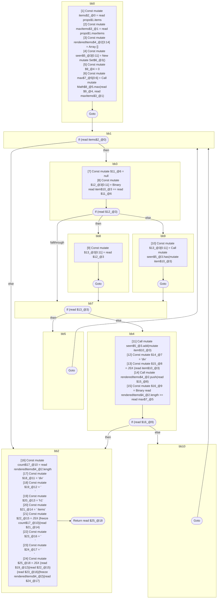

## Input

```javascript
// @Out DefUseGraph
function Component(props) {
  const items = props.items;
  const maxItems = props.maxItems;

  const renderedItems = [];
  const seen = new Set();
  const max = Math.max(0, maxItems);
  for (const item of items) {
    if (item == null || seen.has(item)) {
      continue;
    }
    seen.add(item);
    renderedItems.push(<div>{item}</div>);
    if (renderedItems.length >= max) {
      break;
    }
  }
  const count = renderedItems.length;
  return (
    <div>
      <h1>{count} Items</h1>
      {renderedItems}
    </div>
  );
}

```

## HIR

```
bb0:
  [1] Const mutate items$2_@0 = read props$1.items
  [2] Const mutate maxItems$3_@1 = read props$1.maxItems
  [3] Const mutate renderedItems$4_@2[3:14] = Array []
  [4] Const mutate seen$5_@3[0:11] = New mutate Set$6_@3()
  [5] Const mutate $9_@4 = 0
  [6] Const mutate max$7_@5[0:6] = Call mutate Math$8_@5.max(read $9_@4, read maxItems$3_@1)
  Goto bb1
bb1:
  predecessor blocks: bb0 bb5 bb10
  If (read items$2_@0) then:bb3 else:bb2
bb3:
  predecessor blocks: bb1
  [7] Const mutate $11_@6 = null
  [8] Const mutate $12_@3[0:11] = Binary read item$10_@3 == read $11_@6
  If (read $12_@3) then:bb8 else:bb9
bb8:
  predecessor blocks: bb3
  [9] Const mutate $13_@3[0:11] = read $12_@3
  Goto bb7
bb9:
  predecessor blocks: bb3
  [10] Const mutate $13_@3[0:11] = Call mutate seen$5_@3.has(mutate item$10_@3)
  Goto bb7
bb7:
  predecessor blocks: bb8 bb9
  If (read $13_@3) then:bb5 else:bb4
bb5:
  predecessor blocks: bb7
  Goto(Continue) bb1
bb4:
  predecessor blocks: bb7
  [11] Call mutate seen$5_@3.add(mutate item$10_@3)
  [12] Const mutate $14_@7 = "div"
  [13] Const mutate $15_@8 = JSX <read $14_@7>{read item$10_@3}</read $14_@7>
  [14] Call mutate renderedItems$4_@2.push(read $15_@8)
  [15] Const mutate $16_@9 = Binary read renderedItems$4_@2.length >= read max$7_@5
  If (read $16_@9) then:bb2 else:bb10
bb10:
  predecessor blocks: bb4
  Goto(Continue) bb1
bb2:
  predecessor blocks: bb4 bb1
  [16] Const mutate count$17_@10 = read renderedItems$4_@2.length
  [17] Const mutate $18_@11 = "div"
  [18] Const mutate $19_@12 = "\n      "
  [19] Const mutate $20_@13 = "h1"
  [20] Const mutate $21_@14 = " Items"
  [21] Const mutate $22_@15 = JSX <read $20_@13>{freeze count$17_@10}{read $21_@14}</read $20_@13>
  [22] Const mutate $23_@16 = "\n      "
  [23] Const mutate $24_@17 = "\n    "
  [24] Const mutate $25_@18 = JSX <read $18_@11>{read $19_@12}{read $22_@15}{read $23_@16}{freeze renderedItems$4_@2}{read $24_@17}</read $18_@11>
  Return read $25_@18
```

### CFG



## Code

```javascript
function Component$0(props$1) {
  const items$2 = props$1.items;
  const maxItems$3 = props$1.maxItems;
  const renderedItems$4 = [];
  const seen$5 = new Set$6();
  const max$7 = Math$8.max(0, maxItems$3);
}

```
      