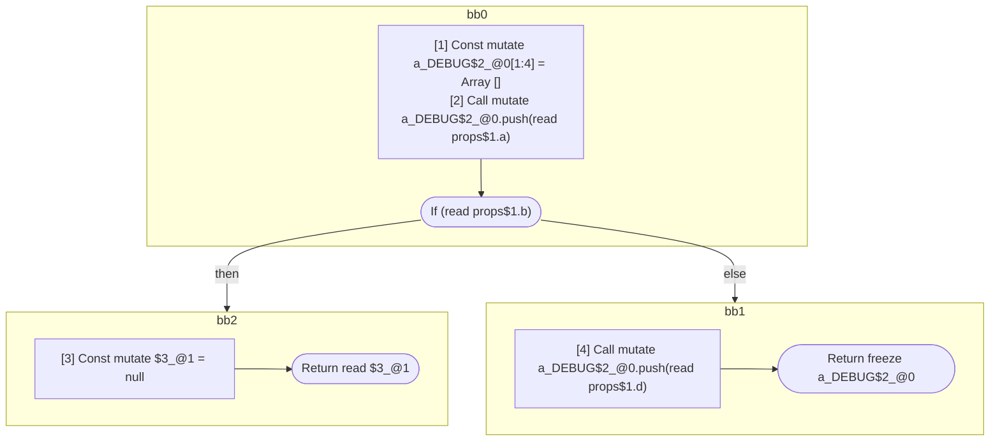
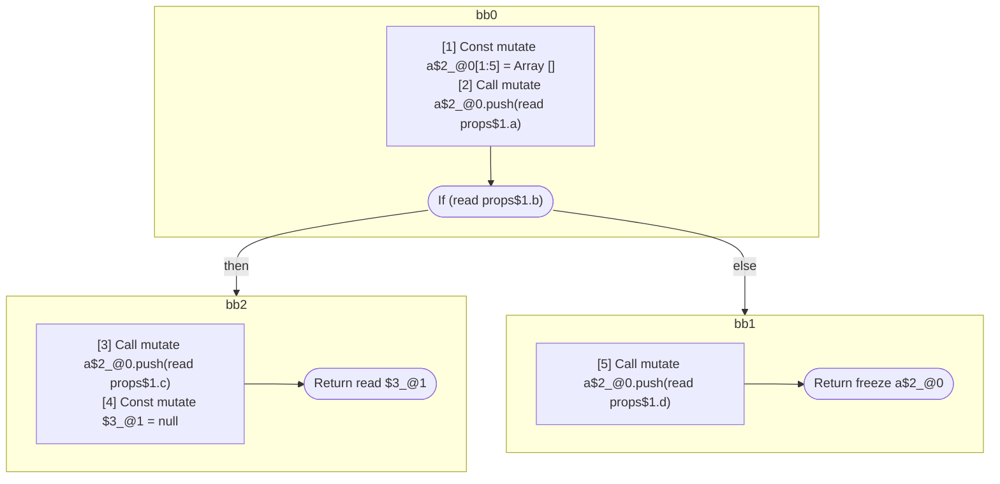
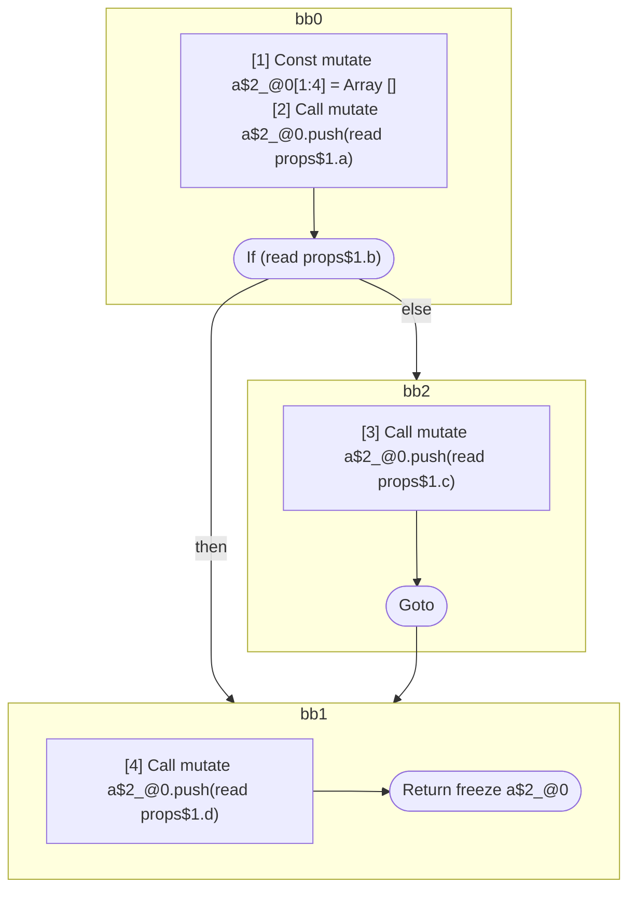

## Input

```javascript
/**
 * props.b does *not* influence `a`
 */
function Component(props) {
  const a_DEBUG = [];
  a_DEBUG.push(props.a);
  if (props.b) {
    return null;
  }
  a_DEBUG.push(props.d);
  return a_DEBUG;
}

/**
 * props.b *does* influence `a`
 */
function Component(props) {
  const a = [];
  a.push(props.a);
  if (props.b) {
    a.push(props.c);
  }
  a.push(props.d);
  return a;
}

/**
 * props.b *does* influence `a`, but only in a way that is never observable
 */
function Component(props) {
  const a = [];
  a.push(props.a);
  if (props.b) {
    a.push(props.c);
    return null;
  }
  a.push(props.d);
  return a;
}

/**
 * props.b *does* influence `a`
 */
function Component(props) {
  const a = [];
  a.push(props.a);
  if (props.b) {
    a.push(props.c);
    return a;
  }
  a.push(props.d);
  return a;
}

/**
 * props.b *does* influence `a`
 */
function Component(props) {
  const a = [];
  a.push(props.a);
  label: {
    if (props.b) {
      break label;
    }
    a.push(props.c);
  }
  a.push(props.d);
  return a;
}

```

## HIR

```
bb0:
  [1] Const mutate a_DEBUG$2_@0[1:4] = Array []
  [2] Call mutate a_DEBUG$2_@0.push(read props$1.a)
  If (read props$1.b) then:bb2 else:bb1
bb2:
  predecessor blocks: bb0
  [3] Const mutate $3_@1 = null
  Return read $3_@1
bb1:
  predecessor blocks: bb0
  [4] Call mutate a_DEBUG$2_@0.push(read props$1.d)
  Return freeze a_DEBUG$2_@0
```

### CFG



## Code

```javascript
function Component$0(props$1) {
  const a_DEBUG$2 = [];
  a_DEBUG$2.push(props$1.a);
  bb1: if (props$1.b) {
    return null;
  }

  a_DEBUG$2.push(props$1.d);
  return a_DEBUG$2;
}

```
## HIR

```
bb0:
  [1] Const mutate a$2_@0[1:4] = Array []
  [2] Call mutate a$2_@0.push(read props$1.a)
  If (read props$1.b) then:bb2 else:bb1
bb2:
  predecessor blocks: bb0
  [3] Call mutate a$2_@0.push(read props$1.c)
  Goto bb1
bb1:
  predecessor blocks: bb2 bb0
  [4] Call mutate a$2_@0.push(read props$1.d)
  Return freeze a$2_@0
```

### CFG


## Code

```javascript
function Component$0(props$1) {
  const a$2 = [];
  a$2.push(props$1.a);
  bb1: if (props$1.b) {
    a$2.push(props$1.c);
  }

  a$2.push(props$1.d);
  return a$2;
}

```
## HIR

```
bb0:
  [1] Const mutate a$2_@0[1:5] = Array []
  [2] Call mutate a$2_@0.push(read props$1.a)
  If (read props$1.b) then:bb2 else:bb1
bb2:
  predecessor blocks: bb0
  [3] Call mutate a$2_@0.push(read props$1.c)
  [4] Const mutate $3_@1 = null
  Return read $3_@1
bb1:
  predecessor blocks: bb0
  [5] Call mutate a$2_@0.push(read props$1.d)
  Return freeze a$2_@0
```

### CFG



## Code

```javascript
function Component$0(props$1) {
  const a$2 = [];
  a$2.push(props$1.a);
  bb1: if (props$1.b) {
    a$2.push(props$1.c);
    return null;
  }

  a$2.push(props$1.d);
  return a$2;
}

```
## HIR

```
bb0:
  [1] Const mutate a$2_@0[1:4] = Array []
  [2] Call mutate a$2_@0.push(read props$1.a)
  If (read props$1.b) then:bb2 else:bb1
bb2:
  predecessor blocks: bb0
  [3] Call mutate a$2_@0.push(read props$1.c)
  Return freeze a$2_@0
bb1:
  predecessor blocks: bb0
  [4] Call mutate a$2_@0.push(read props$1.d)
  Return freeze a$2_@0
```

### CFG


## Code

```javascript
function Component$0(props$1) {
  const a$2 = [];
  a$2.push(props$1.a);
  bb1: if (props$1.b) {
    a$2.push(props$1.c);
    return a$2;
  }

  a$2.push(props$1.d);
  return a$2;
}

```
## HIR

```
bb0:
  [1] Const mutate a$2_@0[1:4] = Array []
  [2] Call mutate a$2_@0.push(read props$1.a)
  If (read props$1.b) then:bb1 else:bb2
bb2:
  predecessor blocks: bb0
  [3] Call mutate a$2_@0.push(read props$1.c)
  Goto bb1
bb1:
  predecessor blocks: bb0 bb2
  [4] Call mutate a$2_@0.push(read props$1.d)
  Return freeze a$2_@0
```

### CFG



## Code

```javascript
function Component$0(props$1) {
  const a$2 = [];
  a$2.push(props$1.a);
  bb2: if (props$1.b) {
    a$2.push(props$1.d);
    return a$2;
  }

  a$2.push(props$1.c);
}

```
      