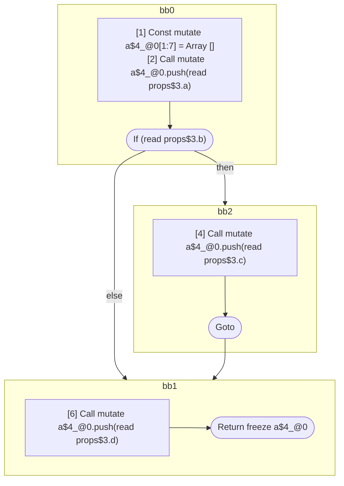
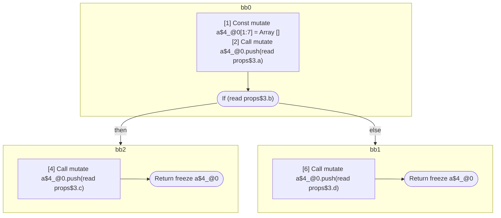
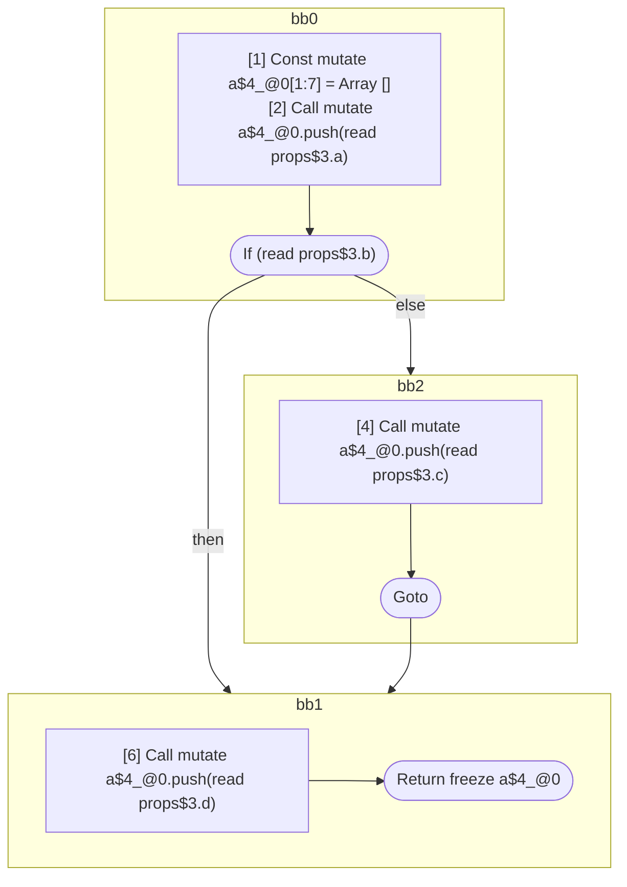

## Input

```javascript
/**
 * props.b does *not* influence `a`
 */
function Component(props) {
  const a_DEBUG = [];
  a_DEBUG.push(props.a);
  if (props.b) {
    return null;
  }
  a_DEBUG.push(props.d);
  return a_DEBUG;
}

/**
 * props.b *does* influence `a`
 */
function Component(props) {
  const a = [];
  a.push(props.a);
  if (props.b) {
    a.push(props.c);
  }
  a.push(props.d);
  return a;
}

/**
 * props.b *does* influence `a`, but only in a way that is never observable
 */
function Component(props) {
  const a = [];
  a.push(props.a);
  if (props.b) {
    a.push(props.c);
    return null;
  }
  a.push(props.d);
  return a;
}

/**
 * props.b *does* influence `a`
 */
function Component(props) {
  const a = [];
  a.push(props.a);
  if (props.b) {
    a.push(props.c);
    return a;
  }
  a.push(props.d);
  return a;
}

/**
 * props.b *does* influence `a`
 */
function Component(props) {
  const a = [];
  a.push(props.a);
  label: {
    if (props.b) {
      break label;
    }
    a.push(props.c);
  }
  a.push(props.d);
  return a;
}

```

## HIR

```
bb0:
  [1] Const mutate a_DEBUG$5_@0[1:7] = Array []
  [2] Call mutate a_DEBUG$5_@0.push(read props$4.a)
  [3] If (read props$4.b) then:bb2 else:bb1 fallthrough=bb1
bb2:
  predecessor blocks: bb0
  [4] Const mutate $6_@1 = null
  [5] Return read $6_@1
bb1:
  predecessor blocks: bb0
  [6] Call mutate a_DEBUG$5_@0.push(read props$4.d)
  [7] Return freeze a_DEBUG$5_@0
scope0 [1:7]:
  - dependency: read props$4.a
  - dependency: read props$4.b
  - dependency: read props$4.d
```

## Reactive Scopes

```
function Component(
  props,
) {
  scope @0 [1:7] deps=[read props$4.a, read props$4.b, read props$4.d] {
    [1] Const mutate a_DEBUG$5_@0[1:7] = Array []
    [2] Call mutate a_DEBUG$5_@0.push(read props$4.a)
    if (read props$4.b) {
      [4] Const mutate $6_@1 = null
      return read $6_@1
    }
    [6] Call mutate a_DEBUG$5_@0.push(read props$4.d)
  }
  return freeze a_DEBUG$5_@0
}

```

### CFG


## Code

```javascript
function Component$0(props$4) {
  const a_DEBUG$5 = [];
  a_DEBUG$5.push(props$4.a);
  bb1: if (props$4.b) {
    return null;
  }

  a_DEBUG$5.push(props$4.d);
  return a_DEBUG$5;
}

```
## HIR

```
bb0:
  [1] Const mutate a$4_@0[1:7] = Array []
  [2] Call mutate a$4_@0.push(read props$3.a)
  [3] If (read props$3.b) then:bb2 else:bb1 fallthrough=bb1
bb2:
  predecessor blocks: bb0
  [4] Call mutate a$4_@0.push(read props$3.c)
  [5] Goto bb1
bb1:
  predecessor blocks: bb2 bb0
  [6] Call mutate a$4_@0.push(read props$3.d)
  [7] Return freeze a$4_@0
scope0 [1:7]:
  - dependency: read props$3.a
  - dependency: read props$3.c
  - dependency: read props$3.b
  - dependency: read props$3.d
```

## Reactive Scopes

```
function Component(
  props,
) {
  scope @0 [1:7] deps=[read props$3.a, read props$3.c, read props$3.b, read props$3.d] {
    [1] Const mutate a$4_@0[1:7] = Array []
    [2] Call mutate a$4_@0.push(read props$3.a)
    if (read props$3.b) {
      [4] Call mutate a$4_@0.push(read props$3.c)
    }
    [6] Call mutate a$4_@0.push(read props$3.d)
  }
  return freeze a$4_@0
}

```

### CFG



## Code

```javascript
function Component$0(props$3) {
  const a$4 = [];
  a$4.push(props$3.a);
  bb1: if (props$3.b) {
    a$4.push(props$3.c);
  }

  a$4.push(props$3.d);
  return a$4;
}

```
## HIR

```
bb0:
  [1] Const mutate a$5_@0[1:8] = Array []
  [2] Call mutate a$5_@0.push(read props$4.a)
  [3] If (read props$4.b) then:bb2 else:bb1 fallthrough=bb1
bb2:
  predecessor blocks: bb0
  [4] Call mutate a$5_@0.push(read props$4.c)
  [5] Const mutate $6_@1 = null
  [6] Return read $6_@1
bb1:
  predecessor blocks: bb0
  [7] Call mutate a$5_@0.push(read props$4.d)
  [8] Return freeze a$5_@0
scope0 [1:8]:
  - dependency: read props$4.a
  - dependency: read props$4.c
  - dependency: read props$4.b
  - dependency: read props$4.d
```

## Reactive Scopes

```
function Component(
  props,
) {
  scope @0 [1:8] deps=[read props$4.a, read props$4.c, read props$4.b, read props$4.d] {
    [1] Const mutate a$5_@0[1:8] = Array []
    [2] Call mutate a$5_@0.push(read props$4.a)
    if (read props$4.b) {
      [4] Call mutate a$5_@0.push(read props$4.c)
      [5] Const mutate $6_@1 = null
      return read $6_@1
    }
    [7] Call mutate a$5_@0.push(read props$4.d)
  }
  return freeze a$5_@0
}

```

### CFG


## Code

```javascript
function Component$0(props$4) {
  const a$5 = [];
  a$5.push(props$4.a);
  bb1: if (props$4.b) {
    a$5.push(props$4.c);
    return null;
  }

  a$5.push(props$4.d);
  return a$5;
}

```
## HIR

```
bb0:
  [1] Const mutate a$4_@0[1:7] = Array []
  [2] Call mutate a$4_@0.push(read props$3.a)
  [3] If (read props$3.b) then:bb2 else:bb1 fallthrough=bb1
bb2:
  predecessor blocks: bb0
  [4] Call mutate a$4_@0.push(read props$3.c)
  [5] Return freeze a$4_@0
bb1:
  predecessor blocks: bb0
  [6] Call mutate a$4_@0.push(read props$3.d)
  [7] Return freeze a$4_@0
scope0 [1:7]:
  - dependency: read props$3.a
  - dependency: read props$3.c
  - dependency: read props$3.b
  - dependency: read props$3.d
```

## Reactive Scopes

```
function Component(
  props,
) {
  scope @0 [1:7] deps=[read props$3.a, read props$3.c, read props$3.b, read props$3.d] {
    [1] Const mutate a$4_@0[1:7] = Array []
    [2] Call mutate a$4_@0.push(read props$3.a)
    if (read props$3.b) {
      [4] Call mutate a$4_@0.push(read props$3.c)
      return freeze a$4_@0
    }
    [6] Call mutate a$4_@0.push(read props$3.d)
  }
  return freeze a$4_@0
}

```

### CFG



## Code

```javascript
function Component$0(props$3) {
  const a$4 = [];
  a$4.push(props$3.a);
  bb1: if (props$3.b) {
    a$4.push(props$3.c);
    return a$4;
  }

  a$4.push(props$3.d);
  return a$4;
}

```
## HIR

```
bb0:
  [1] Const mutate a$4_@0[1:7] = Array []
  [2] Call mutate a$4_@0.push(read props$3.a)
  [3] If (read props$3.b) then:bb1 else:bb2 fallthrough=bb2
bb2:
  predecessor blocks: bb0
  [4] Call mutate a$4_@0.push(read props$3.c)
  [5] Goto bb1
bb1:
  predecessor blocks: bb0 bb2
  [6] Call mutate a$4_@0.push(read props$3.d)
  [7] Return freeze a$4_@0
scope0 [1:7]:
  - dependency: read props$3.a
  - dependency: read props$3.d
  - dependency: read props$3.c
```

## Reactive Scopes

```
function Component(
  props,
) {
  scope @0 [1:7] deps=[read props$3.a, read props$3.d, read props$3.c] {
    [1] Const mutate a$4_@0[1:7] = Array []
    [2] Call mutate a$4_@0.push(read props$3.a)
    if (read props$3.b) {
      [6] Call mutate a$4_@0.push(read props$3.d)
      return freeze a$4_@0
    }
    [4] Call mutate a$4_@0.push(read props$3.c)
  }
}

```

### CFG



## Code

```javascript
function Component$0(props$3) {
  const a$4 = [];
  a$4.push(props$3.a);
  bb2: if (props$3.b) {
    a$4.push(props$3.d);
    return a$4;
  }

  a$4.push(props$3.c);
}

```
      