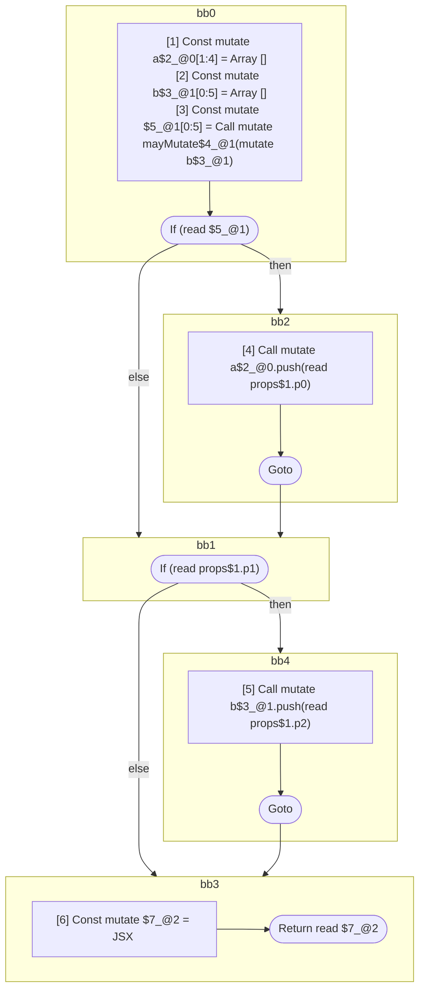

## Input

```javascript
// function Component$forget(props) {
//   scope_a: {
//     const a = [];
//     if (b) {
//       a.push(props.p0);
//     }
//   }
//   scope_b: {
//     const b = [];
//     if (props.p1) {
//       b.push(props.p2);
//     }
//   }
//   scope_return: {
//     return <Foo a={a} b={b} />;
//   }
// }
function Component(props) {
  const a = [];
  const b = [];
  if (b) {
    a.push(props.p0);
  }
  if (props.p1) {
    b.push(props.p2);
  }
  return <Foo a={a} b={b} />;
}

// function Component$forget(props) {
//   scope_a_b: {
//     const a = [];
//     const b = [];
//     if (mayMutate(b)) {
//       a.push(props.p0);
//     }
//     if (props.p1) {
//       b.push(props.p2);
//     }
//   }
//   scope_return: {
//     return <Foo a={a} b={b} />;
//   }
// }
function Component(props) {
  const a = [];
  const b = [];
  if (mayMutate(b)) {
    a.push(props.p0);
  }
  if (props.p1) {
    b.push(props.p2);
  }
  return <Foo a={a} b={b} />;
}

function Foo() {}
function mayMutate() {}

```

## HIR

```
bb0:
  [1] Const mutate a$2_@0[1:3] = Array []
  [2] Const mutate b$3_@1[2:4] = Array []
  If (read b$3_@1) then:bb2 else:bb1
bb2:
  predecessor blocks: bb0
  [3] Call mutate a$2_@0.push(read props$1.p0)
  Goto bb1
bb1:
  predecessor blocks: bb2 bb0
  If (read props$1.p1) then:bb4 else:bb3
bb4:
  predecessor blocks: bb1
  [4] Call mutate b$3_@1.push(read props$1.p2)
  Goto bb3
bb3:
  predecessor blocks: bb4 bb1
  [5] Const mutate $5_@2 = JSX <read Foo$4 a={freeze a$2_@0} b={freeze b$3_@1} ></read Foo$4>
  Return read $5_@2
```

### CFG


## Code

```javascript
function Component$0(props$1) {
  const a$2 = [];
  const b$3 = [];
  bb1: if (b$3) {
    a$2.push(props$1.p0);
  }

  bb3: if (props$1.p1) {
    b$3.push(props$1.p2);
  }

  return <Foo$4 a={a$2} b={b$3}></Foo$4>;
}

```
## HIR

```
bb0:
  [1] Const mutate a$2_@0[1:4] = Array []
  [2] Const mutate b$3_@1[0:5] = Array []
  [3] Const mutate $5_@1[0:5] = Call mutate mayMutate$4_@1(mutate b$3_@1)
  If (read $5_@1) then:bb2 else:bb1
bb2:
  predecessor blocks: bb0
  [4] Call mutate a$2_@0.push(read props$1.p0)
  Goto bb1
bb1:
  predecessor blocks: bb2 bb0
  If (read props$1.p1) then:bb4 else:bb3
bb4:
  predecessor blocks: bb1
  [5] Call mutate b$3_@1.push(read props$1.p2)
  Goto bb3
bb3:
  predecessor blocks: bb4 bb1
  [6] Const mutate $7_@2 = JSX <read Foo$6 a={freeze a$2_@0} b={freeze b$3_@1} ></read Foo$6>
  Return read $7_@2
```

### CFG



## Code

```javascript
function Component$0(props$1) {
  const a$2 = [];
  const b$3 = [];
  bb1: if (mayMutate$4(b$3)) {
    a$2.push(props$1.p0);
  }

  bb3: if (props$1.p1) {
    b$3.push(props$1.p2);
  }

  return <Foo$6 a={a$2} b={b$3}></Foo$6>;
}

```
## HIR

```
bb0:
  Return
```

### CFG


## Code

```javascript
function Foo$0() {
  return;
}

```
## HIR

```
bb0:
  Return
```

### CFG


## Code

```javascript
function mayMutate$0() {
  return;
}

```
      