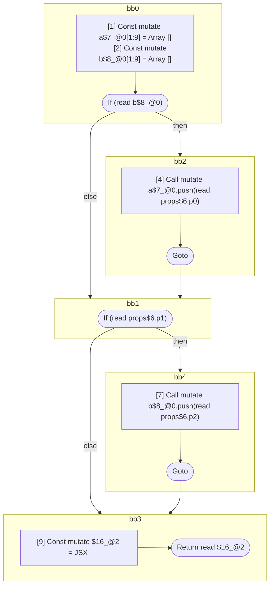
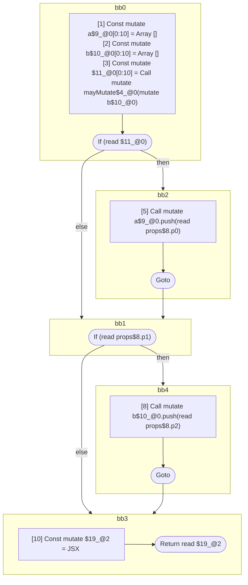
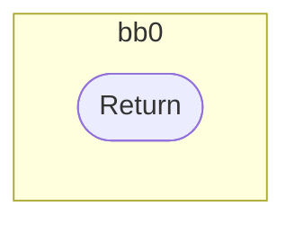

## Input

```javascript
function Component(props) {
  const a = [];
  const b = [];
  if (b) {
    a.push(props.p0);
  }
  if (props.p1) {
    b.push(props.p2);
  }
  return <Foo a={a} b={b} />;
}

function Component(props) {
  const a = [];
  const b = [];
  if (mayMutate(b)) {
    a.push(props.p0);
  }
  if (props.p1) {
    b.push(props.p2);
  }
  return <Foo a={a} b={b} />;
}

function Foo() {}
function mayMutate() {}

```

## HIR

```
bb0:
  [1] Const mutate a$7_@0[1:9] = Array []
  [2] Const mutate b$8_@0[1:9] = Array []
  [3] If (read b$8_@0) then:bb2 else:bb1 fallthrough=bb1
bb2:
  predecessor blocks: bb0
  [4] Call mutate a$7_@0.push(read props$6.p0)
  [5] Goto bb1
bb1:
  predecessor blocks: bb2 bb0
  [6] If (read props$6.p1) then:bb4 else:bb3 fallthrough=bb3
bb4:
  predecessor blocks: bb1
  [7] Call mutate b$8_@0.push(read props$6.p2)
  [8] Goto bb3
bb3:
  predecessor blocks: bb4 bb1
  [9] Const mutate $16_@2 = JSX <read Foo$4 a={freeze a$7_@0} b={freeze b$8_@0} ></read Foo$4>
  [10] Return read $16_@2
scope0 [1:9]:
 - read props$6.p0
 - read props$6.p2
 - read props$6.p1
scope2 [9:10]:
 - freeze a$7_@0
 - freeze b$8_@0
```

### CFG



## Code

```javascript
function Component$0(props$6) {
  const a$7 = [];
  const b$8 = [];
  bb1: if (b$8) {
    a$7.push(props$6.p0);
  }

  bb3: if (props$6.p1) {
    b$8.push(props$6.p2);
  }

  return <Foo$4 a={a$7} b={b$8}></Foo$4>;
}

```
## HIR

```
bb0:
  [1] Const mutate a$9_@0[0:10] = Array []
  [2] Const mutate b$10_@0[0:10] = Array []
  [3] Const mutate $11_@0[0:10] = Call mutate mayMutate$4_@0(mutate b$10_@0)
  [4] If (read $11_@0) then:bb2 else:bb1 fallthrough=bb1
bb2:
  predecessor blocks: bb0
  [5] Call mutate a$9_@0.push(read props$8.p0)
  [6] Goto bb1
bb1:
  predecessor blocks: bb2 bb0
  [7] If (read props$8.p1) then:bb4 else:bb3 fallthrough=bb3
bb4:
  predecessor blocks: bb1
  [8] Call mutate b$10_@0.push(read props$8.p2)
  [9] Goto bb3
bb3:
  predecessor blocks: bb4 bb1
  [10] Const mutate $19_@2 = JSX <read Foo$6 a={freeze a$9_@0} b={freeze b$10_@0} ></read Foo$6>
  [11] Return read $19_@2
scope2 [10:11]:
 - freeze a$9_@0
 - freeze b$10_@0
```

### CFG



## Code

```javascript
function Component$0(props$8) {
  const a$9 = [];
  const b$10 = [];
  bb1: if (mayMutate$4(b$10)) {
    a$9.push(props$8.p0);
  }

  bb3: if (props$8.p1) {
    b$10.push(props$8.p2);
  }

  return <Foo$6 a={a$9} b={b$10}></Foo$6>;
}

```
## HIR

```
bb0:
  [1] Return

```

### CFG



## Code

```javascript
function Foo$0() {}

```
## HIR

```
bb0:
  [1] Return

```

### CFG


## Code

```javascript
function mayMutate$0() {}

```
      