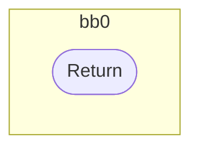
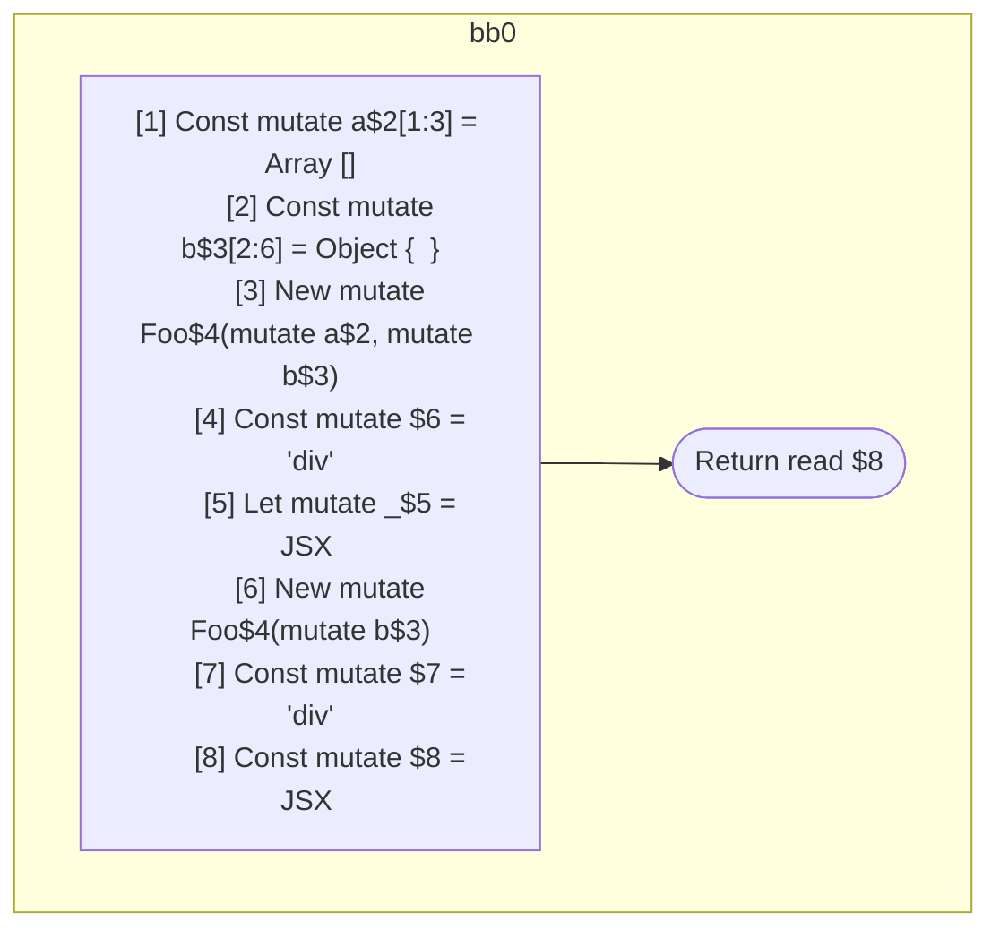

## Input

```javascript
function Foo() {}

function Component(props) {
  const a = [];
  const b = {};
  new Foo(a, b);
  let _ = <div a={a} />;
  new Foo(b);
  return <div a={a} b={b} />;
}

```

## HIR

```
bb0:
  Return
```

### CFG



## Code

```javascript
function Foo$0() {
  return;
}

```
## HIR

```
bb0:
  [1] Const mutate a$2[1:3] = Array []
  [2] Const mutate b$3[2:6] = Object {  }
  [3] New mutate Foo$4(mutate a$2, mutate b$3)
  [4] Const mutate $6 = "div"
  [5] Let mutate _$5 = JSX <read $6 a={freeze a$2} ></read $6>
  [6] New mutate Foo$4(mutate b$3)
  [7] Const mutate $7 = "div"
  [8] Const mutate $8 = JSX <read $7 a={read a$2} b={freeze b$3} ></read $7>
  Return read $8
```

### CFG



## Code

```javascript
function Component$0(props$1) {
  const a$2 = [];
  const b$3 = {};
  new Foo$4(a$2, b$3);
  let _$5 = <div a={a$2}></div>;

  new Foo$4(b$3);
  return <div a={a$2} b={b$3}></div>;
}

```
      