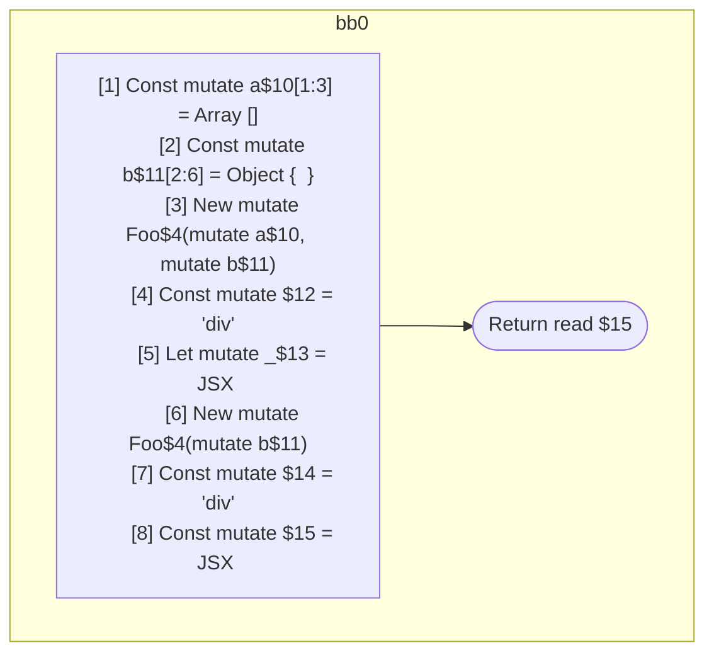

## Input

```javascript
function Foo() {}

function Component(props) {
  const a = [];
  const b = {};
  new Foo(a, b);
  let _ = <div a={a} />;
  new Foo(b);
  return <div a={a} b={b} />;
}

```

## HIR

```
bb0:
  Return
```

### CFG


## Code

```javascript
function Foo$0() {
  return;
}

```
## HIR

```
bb0:
  [1] Const mutate a$10[1:3] = Array []
  [2] Const mutate b$11[2:6] = Object {  }
  [3] New mutate Foo$4(mutate a$10, mutate b$11)
  [4] Const mutate $12 = "div"
  [5] Let mutate _$13 = JSX <read $12 a={freeze a$10} ></read $12>
  [6] New mutate Foo$4(mutate b$11)
  [7] Const mutate $14 = "div"
  [8] Const mutate $15 = JSX <read $14 a={read a$10} b={freeze b$11} ></read $14>
  Return read $15
```

### CFG



## Code

```javascript
function Component$0(props$9) {
  const a$10 = [];
  const b$11 = {};
  new Foo$4(a$10, b$11);
  let _$13 = <div a={a$10}></div>;

  new Foo$4(b$11);
  return <div a={a$10} b={b$11}></div>;
}

```
      