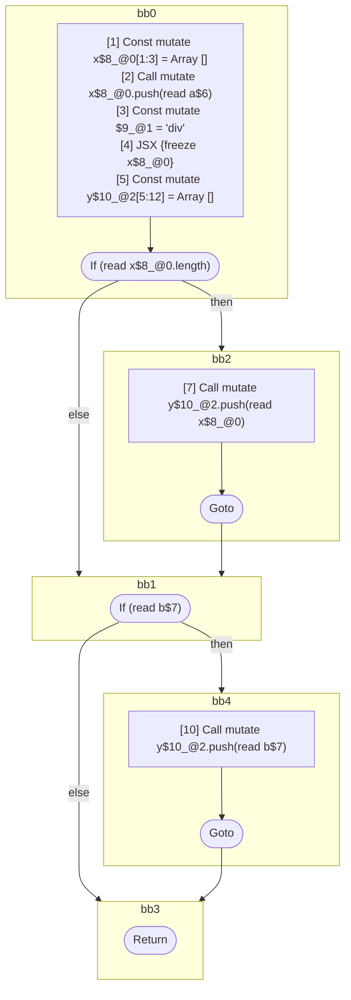

## Input

```javascript
function foo(a, b) {
  const x = [];
  x.push(a);
  <div>{x}</div>;

  const y = [];
  if (x.length) {
    y.push(x);
  }
  if (b) {
    y.push(b);
  }
}

```

## HIR

```
bb0:
  [1] Const mutate x$8_@0[1:3] = Array []
  [2] Call mutate x$8_@0.push(read a$6)
  [3] Const mutate $9_@1 = "div"
  [4] JSX <read $9_@1>{freeze x$8_@0}</read $9_@1>
  [5] Const mutate y$10_@2[5:12] = Array []
  [6] If (read x$8_@0.length) then:bb2 else:bb1 fallthrough=bb1
bb2:
  predecessor blocks: bb0
  [7] Call mutate y$10_@2.push(read x$8_@0)
  [8] Goto bb1
bb1:
  predecessor blocks: bb2 bb0
  [9] If (read b$7) then:bb4 else:bb3 fallthrough=bb3
bb4:
  predecessor blocks: bb1
  [10] Call mutate y$10_@2.push(read b$7)
  [11] Goto bb3
bb3:
  predecessor blocks: bb4 bb1
  [12] Return
scope0 [1:3]:
 - read a$6
scope1 [3:4]:
 - freeze x$8_@0
scope2 [5:12]:
 - read x$8_@0
 - read x$8_@0.length
 - read b$7
 - read b$7
```

### CFG



## Code

```javascript
function foo$0(a$6, b$7) {
  const x$8 = [];
  x$8.push(a$6);
  <div>{x$8}</div>;
  const y$10 = [];
  bb1: if (x$8.length) {
    y$10.push(x$8);
  }

  bb3: if (b$7) {
    y$10.push(b$7);
  }
}

```
      