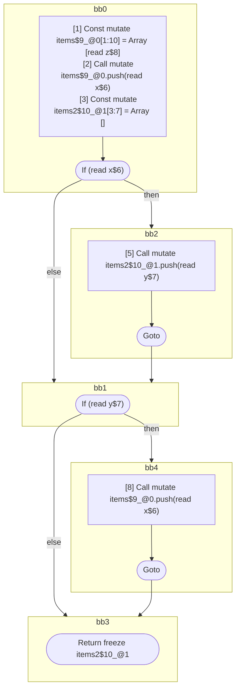

## Input

```javascript
function foo(x, y, z) {
  const items = [z];
  items.push(x);

  const items2 = [];
  if (x) {
    items2.push(y);
  }

  if (y) {
    items.push(x);
  }

  return items2;
}

```

## HIR

```
bb0:
  [1] Const mutate items$9_@0[1:10] = Array [read z$8]
  [2] Call mutate items$9_@0.push(read x$6)
  [3] Const mutate items2$10_@1[3:7] = Array []
  [4] If (read x$6) then:bb2 else:bb1
bb2:
  predecessor blocks: bb0
  [5] Call mutate items2$10_@1.push(read y$7)
  [6] Goto bb1
bb1:
  predecessor blocks: bb2 bb0
  [7] If (read y$7) then:bb4 else:bb3
bb4:
  predecessor blocks: bb1
  [8] Call mutate items$9_@0.push(read x$6)
  [9] Goto bb3
bb3:
  predecessor blocks: bb4 bb1
  [10] Return freeze items2$10_@1
scope0 [1:10]:
 - read z$8
 - read x$6
 - read x$6
 - read y$7
scope1 [3:7]:
 - read y$7
 - read x$6
```

### CFG



## Code

```javascript
function foo$0(x$1, y$2, z$3) {
  const items$4 = [z$3];
  items$4.push(x$1);
  const items2$5 = [];
  bb1: if (x$1) {
    items2$5.push(y$2);
  }

  bb3: if (y$2) {
    items$4.push(x$1);
  }

  return items2$5;
}

```
      