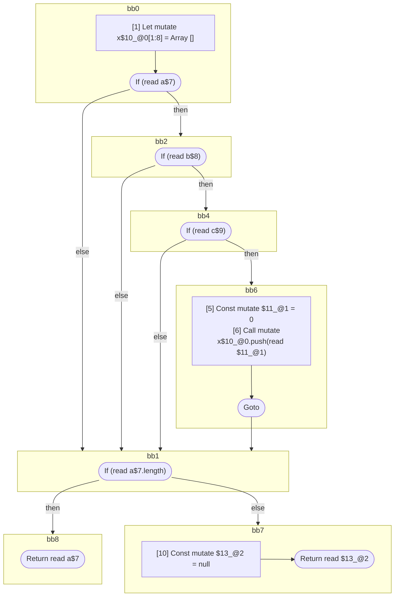

## Input

```javascript
function foo(a, b, c) {
  let x = [];
  if (a) {
    if (b) {
      if (c) {
        x.push(0);
      }
    }
  }
  if (a.length) {
    return a;
  }
  return null;
}

```

## HIR

```
bb0:
  [1] Let mutate x$10_@0[1:8] = Array []
  [2] If (read a$7) then:bb2 else:bb1 fallthrough=bb1
bb2:
  predecessor blocks: bb0
  [3] If (read b$8) then:bb4 else:bb1 fallthrough=bb1
bb4:
  predecessor blocks: bb2
  [4] If (read c$9) then:bb6 else:bb1 fallthrough=bb1
bb6:
  predecessor blocks: bb4
  [5] Const mutate $11_@1 = 0
  [6] Call mutate x$10_@0.push(read $11_@1)
  [7] Goto bb1
bb1:
  predecessor blocks: bb6 bb4 bb2 bb0
  [8] If (read a$7.length) then:bb8 else:bb7 fallthrough=bb7
bb8:
  predecessor blocks: bb1
  [9] Return read a$7
bb7:
  predecessor blocks: bb1
  [10] Const mutate $13_@2 = null
  [11] Return read $13_@2
scope0 [1:8]:
 - read c$9
 - read b$8
 - read a$7
```

### CFG



## Code

```javascript
function foo$0(a$7, b$8, c$9) {
  const x$10 = [];
  bb1: if (a$7) {
    if (b$8) {
      if (c$9) {
        x$10.push(0);
      }
    }
  }

  bb7: if (a$7.length) {
    return a$7;
  }

  return null;
}

```
      