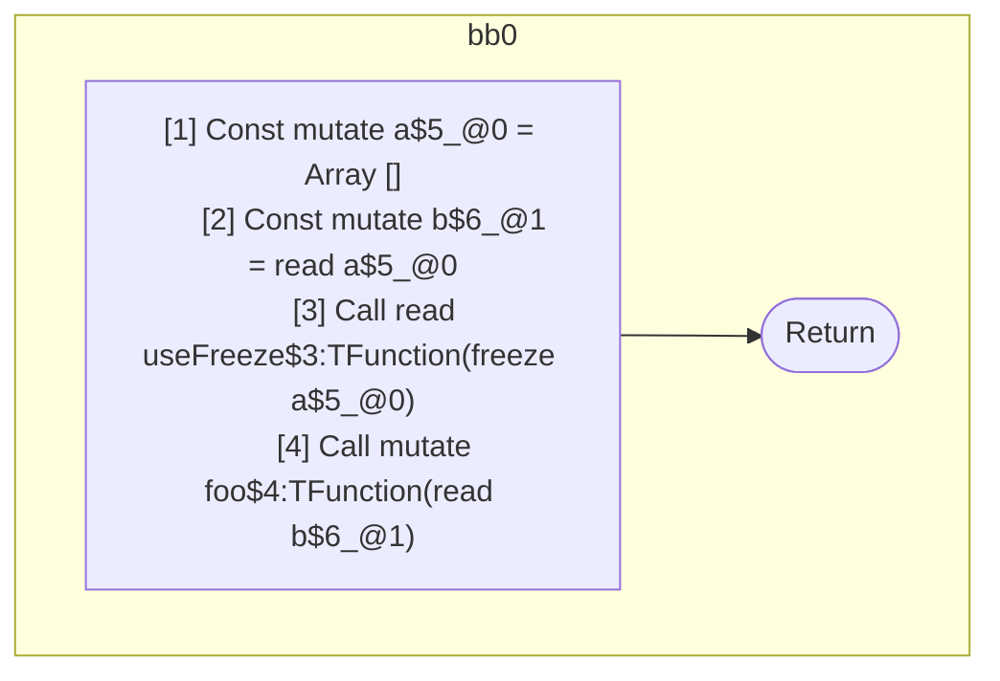

## Input

```javascript
function Component() {
  const a = [];
  const b = a;
  useFreeze(a);
  foo(b); // should be readonly, value is guaranteed frozen via alias
}

function useFreeze() {}
function foo(x) {}

```

## HIR

```
bb0:
  [1] Const mutate a$5_@0 = Array []
  [2] Const mutate b$6_@1 = read a$5_@0
  [3] Call read useFreeze$3:TFunction(freeze a$5_@0)
  [4] Call mutate foo$4:TFunction(read b$6_@1)
  [5] Return
scope1 [2:3]:
  - dependency: read a$5_@0
  - dependency: freeze a$5_@0
```

## Reactive Scopes

```
function Component(
) {
  scope @0 [1:2] deps=[] {
    [1] Const mutate a$5_@0 = Array []
  }
  [2] Const mutate b$6_@1 = read a$5_@0
  [3] Call read useFreeze$3:TFunction(freeze a$5_@0)
  [4] Call mutate foo$4:TFunction(read b$6_@1)
  return
}

```

### CFG



## Code

```javascript
function Component$0() {
  const a$5 = [];
  const b$6 = a$5;
  useFreeze$3(a$5);
  foo$4(b$6);
}

```
## HIR

```
bb0:
  [1] Return

```

## Reactive Scopes

```
function useFreeze(
) {
  return
}

```

### CFG


## Code

```javascript
function useFreeze$0() {}

```
## HIR

```
bb0:
  [1] Return

```

## Reactive Scopes

```
function foo(
  x,
) {
  return
}

```

### CFG


## Code

```javascript
function foo$0(x$2) {}

```
      