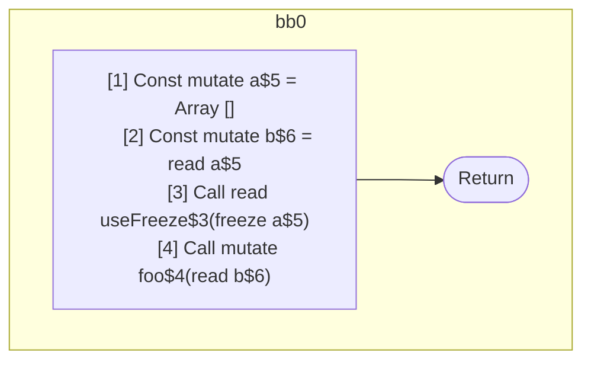

## Input

```javascript
function Component() {
  const a = [];
  const b = a;
  useFreeze(a);
  foo(b); // should be readonly, value is guaranteed frozen via alias
}

function useFreeze() {}
function foo(x) {}

```

## HIR

```
bb0:
  [1] Const mutate a$5 = Array []
  [2] Const mutate b$6 = read a$5
  [3] Call read useFreeze$3(freeze a$5)
  [4] Call mutate foo$4(read b$6)
  Return
```

### CFG



## Code

```javascript
function Component$0() {
  const a$5 = [];
  const b$6 = a$5;
  useFreeze$3(a$5);
  foo$4(b$6);
  return;
}

```
## HIR

```
bb0:
  Return
```

### CFG


## Code

```javascript
function useFreeze$0() {
  return;
}

```
## HIR

```
bb0:
  Return
```

### CFG


## Code

```javascript
function foo$0(x$2) {
  return;
}

```
      