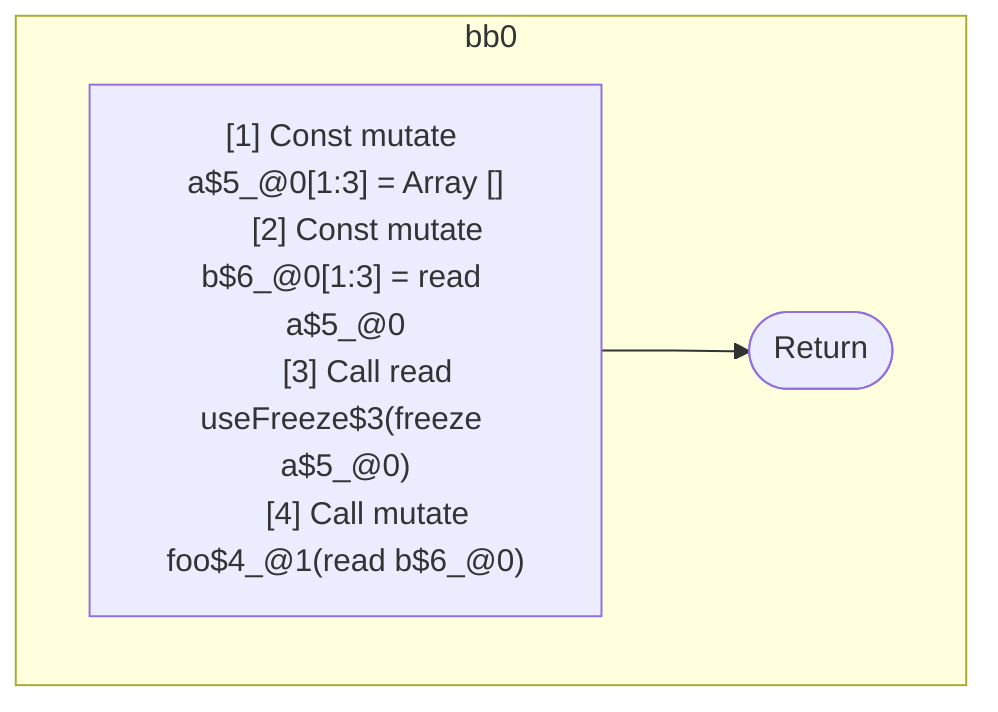
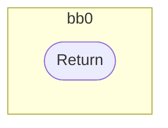

## Input

```javascript
function Component() {
  const a = [];
  const b = a;
  useFreeze(a);
  foo(b); // should be readonly, value is guaranteed frozen via alias
}

function useFreeze() {}
function foo(x) {}

```

## HIR

```
bb0:
  [1] Const mutate a$5_@0[1:3] = Array []
  [2] Const mutate b$6_@0[1:3] = read a$5_@0
  [3] Call read useFreeze$3(freeze a$5_@0)
  [4] Call mutate foo$4_@1(read b$6_@0)
  [5] Return
```

### CFG



## Code

```javascript
function Component$0() {
  const a$1 = [];
  const b$2 = a$1;
  useFreeze$3(a$1);
  foo$4(b$2);
}

```
## HIR

```
bb0:
  [1] Return
```

### CFG



## Code

```javascript
function useFreeze$0() {}

```
## HIR

```
bb0:
  [1] Return
```

### CFG


## Code

```javascript
function foo$0(x$1) {}

```
      