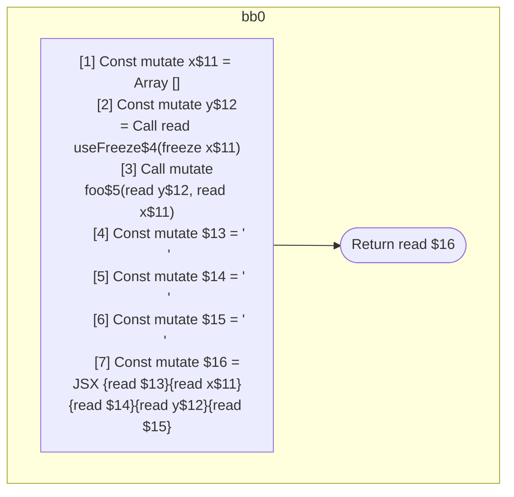

## Input

```javascript
function useFreeze() {}
function foo() {}

function Component(props) {
  const x = [];
  const y = useFreeze(x);
  foo(y, x);
  return (
    <Component>
      {x}
      {y}
    </Component>
  );
}

```

## HIR

```
bb0:
  Return
```

### CFG


## Code

```javascript
function useFreeze$0() {
  return;
}

```
## HIR

```
bb0:
  Return
```

### CFG


## Code

```javascript
function foo$0() {
  return;
}

```
## HIR

```
bb0:
  [1] Const mutate x$11 = Array []
  [2] Const mutate y$12 = Call read useFreeze$4(freeze x$11)
  [3] Call mutate foo$5(read y$12, read x$11)
  [4] Const mutate $13 = "\n      "
  [5] Const mutate $14 = "\n      "
  [6] Const mutate $15 = "\n    "
  [7] Const mutate $16 = JSX <read Component$0>{read $13}{read x$11}{read $14}{read y$12}{read $15}</read Component$0>
  Return read $16
```

### CFG



## Code

```javascript
function Component$0(props$10) {
  const x$11 = [];
  const y$12 = useFreeze$4(x$11);
  foo$5(y$12, x$11);
  return (
    <Component$0>
      {x$11}
      {y$12}
    </Component$0>
  );
}

```
      