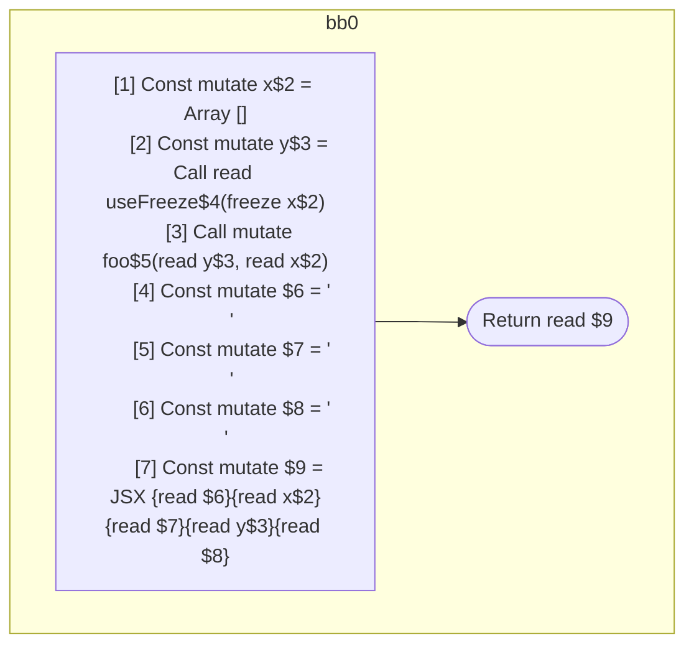

## Input

```javascript
function useFreeze() {}
function foo() {}

function Component(props) {
  const x = [];
  const y = useFreeze(x);
  foo(y, x);
  return (
    <Component>
      {x}
      {y}
    </Component>
  );
}

```

## HIR

```
bb0:
  Return
```

### CFG


## Code

```javascript
function useFreeze$0() {
  return;
}

```
## HIR

```
bb0:
  Return
```

### CFG


## Code

```javascript
function foo$0() {
  return;
}

```
## HIR

```
bb0:
  [1] Const mutate x$2 = Array []
  [2] Const mutate y$3 = Call read useFreeze$4(freeze x$2)
  [3] Call mutate foo$5(read y$3, read x$2)
  [4] Const mutate $6 = "\n      "
  [5] Const mutate $7 = "\n      "
  [6] Const mutate $8 = "\n    "
  [7] Const mutate $9 = JSX <read Component$0>{read $6}{read x$2}{read $7}{read y$3}{read $8}</read Component$0>
  Return read $9
```

### CFG



## Code

```javascript
function Component$0(props$1) {
  const x$2 = [];
  const y$3 = useFreeze$4(x$2);
  foo$5(y$3, x$2);
  return (
    <Component$0>
      {x$2}
      {y$3}
    </Component$0>
  );
}

```
      