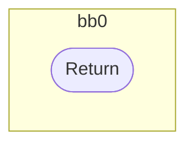
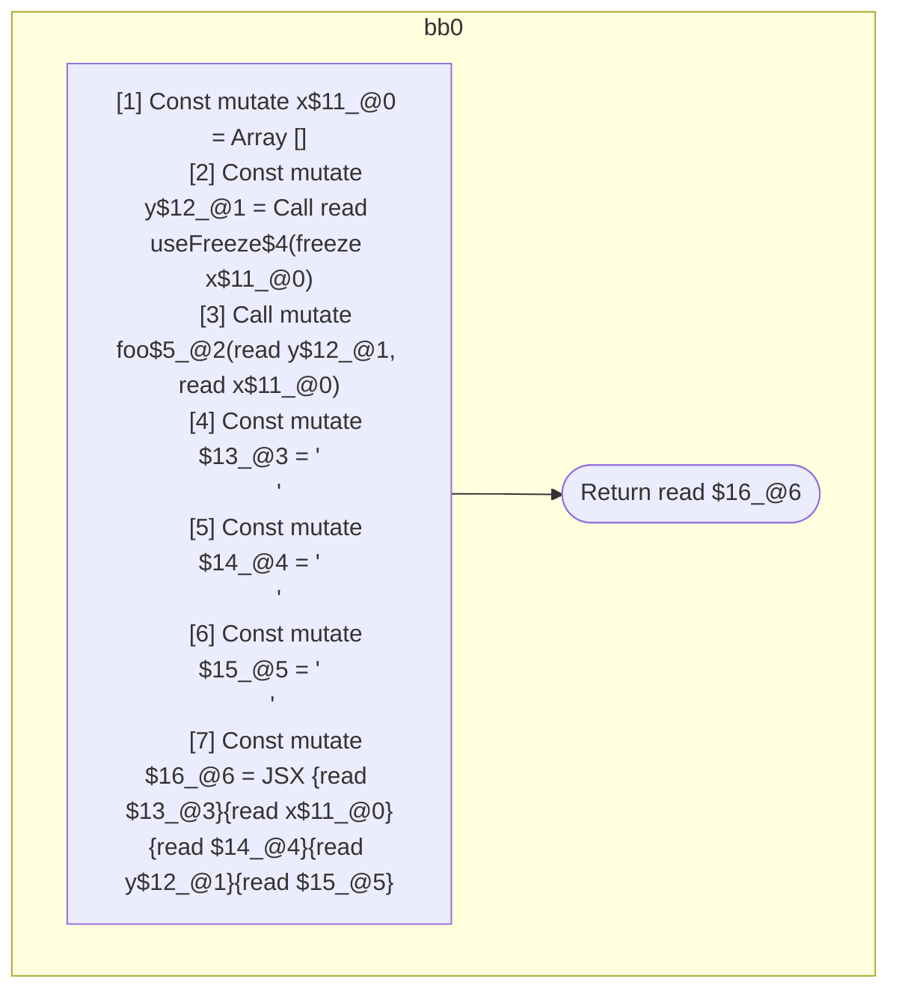

## Input

```javascript
function useFreeze() {}
function foo() {}

function Component(props) {
  const x = [];
  const y = useFreeze(x);
  foo(y, x);
  return (
    <Component>
      {x}
      {y}
    </Component>
  );
}

```

## HIR

```
bb0:
  [1] Return
```

### CFG



## Code

```javascript
function useFreeze$0() {}

```
## HIR

```
bb0:
  [1] Return
```

### CFG


## Code

```javascript
function foo$0() {}

```
## HIR

```
bb0:
  [1] Const mutate x$11_@0 = Array []
  [2] Const mutate y$12_@1 = Call read useFreeze$4(freeze x$11_@0)
  [3] Call mutate foo$5_@2(read y$12_@1, read x$11_@0)
  [4] Const mutate $13_@3 = "\n      "
  [5] Const mutate $14_@4 = "\n      "
  [6] Const mutate $15_@5 = "\n    "
  [7] Const mutate $16_@6 = JSX <read Component$0>{read $13_@3}{read x$11_@0}{read $14_@4}{read y$12_@1}{read $15_@5}</read Component$0>
  [8] Return read $16_@6
```

### CFG



## Code

```javascript
function Component$0(props$1) {
  const x$2 = [];
  const y$3 = useFreeze$4(x$2);
  foo$5(y$3, x$2);
  return (
    <Component$0>
      {x$2}
      {y$3}
    </Component$0>
  );
}

```
      