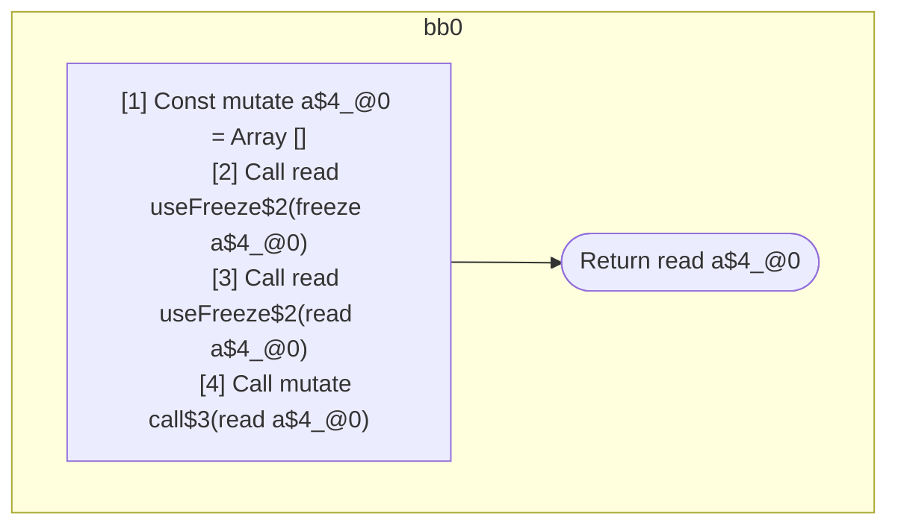

## Input

```javascript
function Component() {
  const a = [];
  useFreeze(a); // should freeze
  useFreeze(a); // should be readonly
  call(a); // should be readonly
  return a;
}

function useFreeze(x) {}
function call(x) {}

```

## HIR

```
bb0:
  [1] Const mutate a$4_@0 = Array []
  [2] Call read useFreeze$2(freeze a$4_@0)
  [3] Call read useFreeze$2(read a$4_@0)
  [4] Call mutate call$3(read a$4_@0)
  [5] Return read a$4_@0

```

## Reactive Scopes

```
function Component(
) {
  scope @0 [1:2] deps=[] {
    [1] Const mutate a$4_@0 = Array []
  }
  [2] Call read useFreeze$2(freeze a$4_@0)
  [3] Call read useFreeze$2(read a$4_@0)
  [4] Call mutate call$3(read a$4_@0)
  return read a$4_@0
}

```

### CFG



## Code

```javascript
function Component$0() {
  const a$4 = [];
  useFreeze$2(a$4);
  useFreeze$2(a$4);
  call$3(a$4);
  return a$4;
}

```
## HIR

```
bb0:
  [1] Return

```

## Reactive Scopes

```
function useFreeze(
  x,
) {
  return
}

```

### CFG


## Code

```javascript
function useFreeze$0(x$2) {}

```
## HIR

```
bb0:
  [1] Return

```

## Reactive Scopes

```
function call(
  x,
) {
  return
}

```

### CFG


## Code

```javascript
function call$0(x$2) {}

```
      