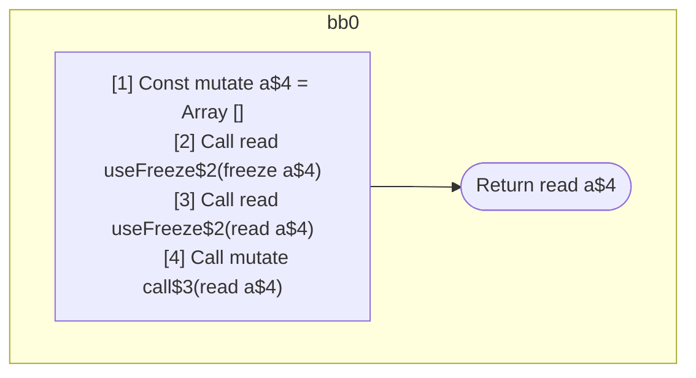

## Input

```javascript
function Component() {
  const a = [];
  useFreeze(a); // should freeze
  useFreeze(a); // should be readonly
  call(a); // should be readonly
  return a;
}

function useFreeze(x) {}
function call(x) {}

```

## HIR

```
bb0:
  [1] Const mutate a$4 = Array []
  [2] Call read useFreeze$2(freeze a$4)
  [3] Call read useFreeze$2(read a$4)
  [4] Call mutate call$3(read a$4)
  Return read a$4
```

### CFG



## Code

```javascript
function Component$0() {
  const a$4 = [];
  useFreeze$2(a$4);
  useFreeze$2(a$4);
  call$3(a$4);
  return a$4;
}

```
## HIR

```
bb0:
  Return
```

### CFG


## Code

```javascript
function useFreeze$0(x$2) {
  return;
}

```
## HIR

```
bb0:
  Return
```

### CFG


## Code

```javascript
function call$0(x$2) {
  return;
}

```
      