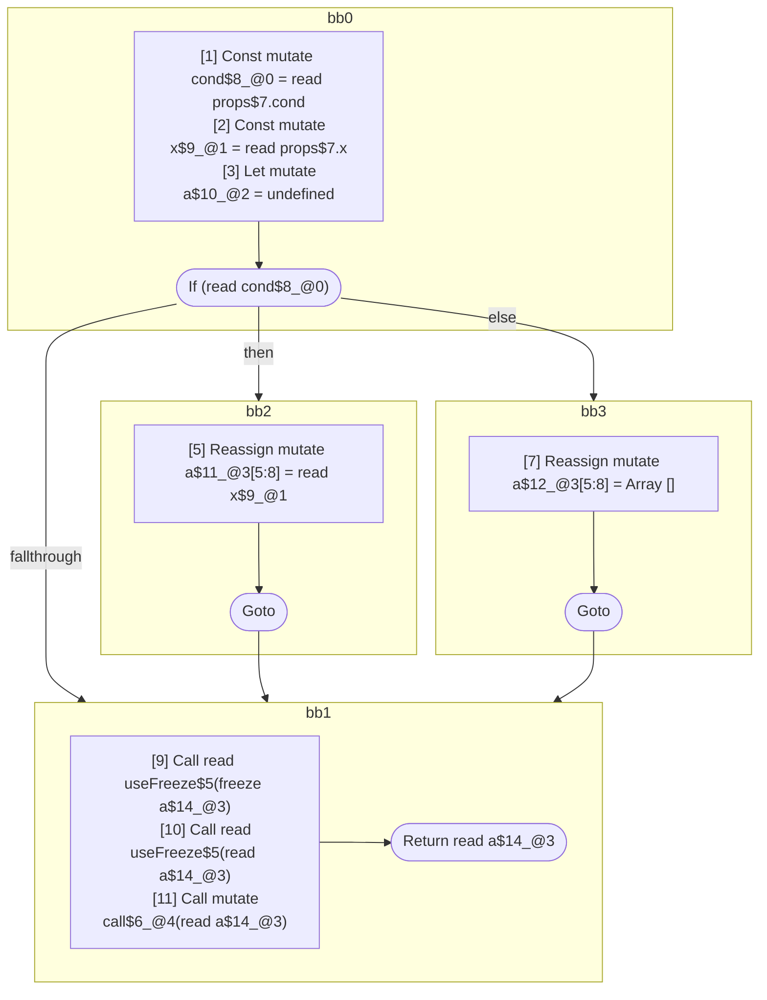
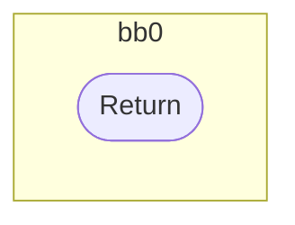

## Input

```javascript
function Component(props) {
  const cond = props.cond;
  const x = props.x;
  let a;
  if (cond) {
    a = x;
  } else {
    a = [];
  }
  useFreeze(a); // should freeze, value *may* be mutable
  useFreeze(a); // should be readonly
  call(a); // should be readonly
  return a;
}

function useFreeze(x) {}
function call(x) {}

```

## HIR

```
bb0:
  [1] Const mutate cond$8_@0 = read props$7.cond
  [2] Const mutate x$9_@1 = read props$7.x
  [3] Let mutate a$10_@2 = undefined
  [4] If (read cond$8_@0) then:bb2 else:bb3 fallthrough=bb1
bb2:
  predecessor blocks: bb0
  [5] Reassign mutate a$11_@3[5:8] = read x$9_@1
  [6] Goto bb1
bb3:
  predecessor blocks: bb0
  [7] Reassign mutate a$12_@3[5:8] = Array []
  [8] Goto bb1
bb1:
  predecessor blocks: bb2 bb3
  a$14_@3[5:8]: phi(bb2: a$11_@3, bb3: a$12_@3)
  [9] Call read useFreeze$5(freeze a$14_@3)
  [10] Call read useFreeze$5(read a$14_@3)
  [11] Call mutate call$6_@4(read a$14_@3)
  [12] Return read a$14_@3
scope0 [1:2]:
 - read props$7.cond
scope1 [2:3]:
 - read props$7.x
scope3 [5:8]:
 - read x$9_@1
```

### CFG



## Code

```javascript
function Component$0(props$7) {
  const cond$8 = props$7.cond;
  const x$9 = props$7.x;
  const a$10 = undefined;
  let a$11 = undefined;
  bb1: if (cond$8) {
    a$11 = x$9;
  } else {
    a$11 = [];
  }

  useFreeze$5(a$11);
  useFreeze$5(a$11);
  call$6(a$11);
  return a$11;
}

```
## HIR

```
bb0:
  [1] Return

```

### CFG



## Code

```javascript
function useFreeze$0(x$2) {}

```
## HIR

```
bb0:
  [1] Return

```

### CFG


## Code

```javascript
function call$0(x$2) {}

```
      