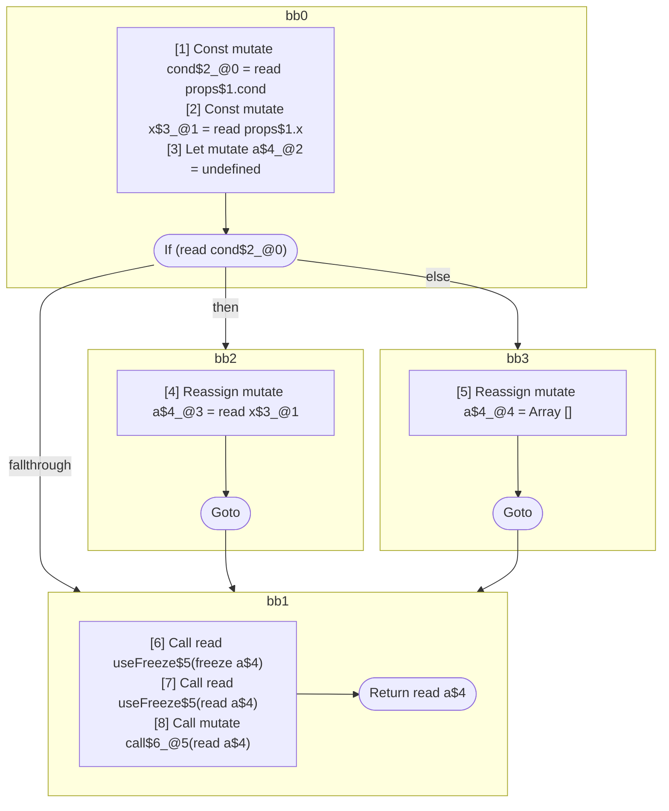

## Input

```javascript
function Component(props) {
  const cond = props.cond;
  const x = props.x;
  let a;
  if (cond) {
    a = x;
  } else {
    a = [];
  }
  useFreeze(a); // should freeze, value *may* be mutable
  useFreeze(a); // should be readonly
  call(a); // should be readonly
  return a;
}

function useFreeze(x) {}
function call(x) {}

```

## HIR

```
bb0:
  [1] Const mutate cond$2_@0 = read props$1.cond
  [2] Const mutate x$3_@1 = read props$1.x
  [3] Let mutate a$4_@2 = undefined
  If (read cond$2_@0) then:bb2 else:bb3
bb2:
  predecessor blocks: bb0
  [4] Reassign mutate a$4_@3 = read x$3_@1
  Goto bb1
bb3:
  predecessor blocks: bb0
  [5] Reassign mutate a$4_@4 = Array []
  Goto bb1
bb1:
  predecessor blocks: bb2 bb3
  [6] Call read useFreeze$5(freeze a$4)
  [7] Call read useFreeze$5(read a$4)
  [8] Call mutate call$6_@5(read a$4)
  Return read a$4
```

### CFG



## Code

```javascript
function Component$0(props$1) {
  const cond$2 = props$1.cond;
  const x$3 = props$1.x;
  let a$4 = undefined;
  bb1: if (cond$2) {
    a$4 = x$3;
  } else {
    a$4 = [];
  }

  useFreeze$5(a$4);
  useFreeze$5(a$4);
  call$6(a$4);
  return a$4;
}

```
## HIR

```
bb0:
  Return
```

### CFG


## Code

```javascript
function useFreeze$0(x$1) {
  return;
}

```
## HIR

```
bb0:
  Return
```

### CFG


## Code

```javascript
function call$0(x$1) {
  return;
}

```
      