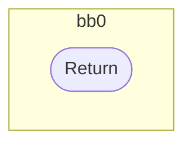
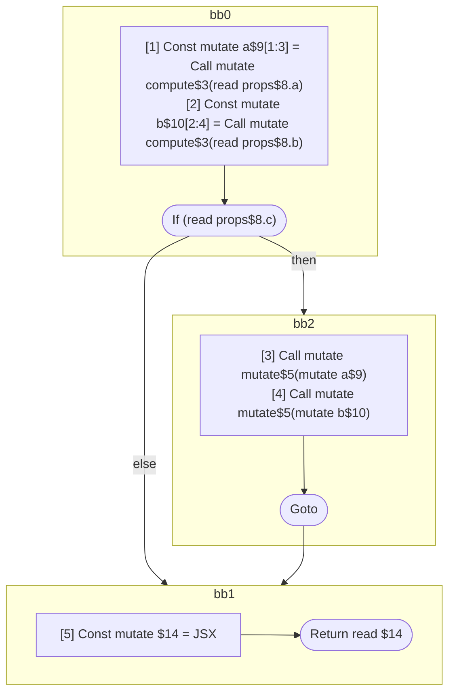

## Input

```javascript
function compute() {}
function mutate() {}
function foo() {}
function Foo() {}

/**
 * Should produce 3 scopes:
 *
 * a: inputs=props.a & props.c; outputs=a
 *   a = compute(props.a);
 *   if (props.c)
 *     mutate(a)
 * b: inputs=props.b & props.c; outputs=b
 *   b = compute(props.b);
 *   if (props.c)
 *     mutate(b)
 * return: inputs=a, b outputs=return
 *   return = <Foo a={a} b={b} />
 */
function Component(props) {
  const a = compute(props.a);
  const b = compute(props.b);
  if (props.c) {
    mutate(a);
    mutate(b);
  }
  return <Foo a={a} b={b} />;
}

```

## HIR

```
bb0:
  Return
```

### CFG



## Code

```javascript
function compute$0() {
  return;
}

```
## HIR

```
bb0:
  Return
```

### CFG


## Code

```javascript
function mutate$0() {
  return;
}

```
## HIR

```
bb0:
  Return
```

### CFG


## Code

```javascript
function foo$0() {
  return;
}

```
## HIR

```
bb0:
  Return
```

### CFG


## Code

```javascript
function Foo$0() {
  return;
}

```
## HIR

```
bb0:
  [1] Const mutate a$9[1:3] = Call mutate compute$3(read props$8.a)
  [2] Const mutate b$10[2:4] = Call mutate compute$3(read props$8.b)
  If (read props$8.c) then:bb2 else:bb1
bb2:
  predecessor blocks: bb0
  [3] Call mutate mutate$5(mutate a$9)
  [4] Call mutate mutate$5(mutate b$10)
  Goto bb1
bb1:
  predecessor blocks: bb2 bb0
  [5] Const mutate $14 = JSX <read Foo$6 a={freeze a$9} b={freeze b$10} ></read Foo$6>
  Return read $14
```

### CFG



## Code

```javascript
function Component$0(props$8) {
  const a$9 = compute$3(props$8.a);
  const b$10 = compute$3(props$8.b);
  bb1: if (props$8.c) {
    mutate$5(a$9);
    mutate$5(b$10);
  }

  return <Foo$6 a={a$9} b={b$10}></Foo$6>;
}

```
      