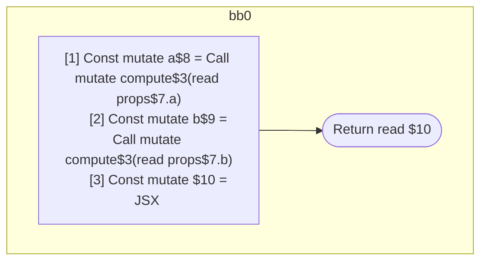

## Input

```javascript
/**
 * Should produce 3 scopes:
 *
 * a: inputs=props.a, outputs=a
 *   a = compute(props.a);
 * b: inputs=props.b, outputs=b
 *   b = compute(props.b);
 * return: inputs=a, b outputs=return
 *   return = <Foo a={a} b={b} />
 */
function Component(props) {
  const a = compute(props.a);
  const b = compute(props.b);
  return <Foo a={a} b={b} />;
}

function compute() {}
function foo() {}
function Foo() {}

```

## HIR

```
bb0:
  [1] Const mutate a$8 = Call mutate compute$3(read props$7.a)
  [2] Const mutate b$9 = Call mutate compute$3(read props$7.b)
  [3] Const mutate $10 = JSX <read Foo$5 a={freeze a$8} b={freeze b$9} ></read Foo$5>
  Return read $10
```

### CFG



## Code

```javascript
function Component$0(props$7) {
  const a$8 = compute$3(props$7.a);
  const b$9 = compute$3(props$7.b);
  return <Foo$5 a={a$8} b={b$9}></Foo$5>;
}

```
## HIR

```
bb0:
  Return
```

### CFG


## Code

```javascript
function compute$0() {
  return;
}

```
## HIR

```
bb0:
  Return
```

### CFG


## Code

```javascript
function foo$0() {
  return;
}

```
## HIR

```
bb0:
  Return
```

### CFG


## Code

```javascript
function Foo$0() {
  return;
}

```
      