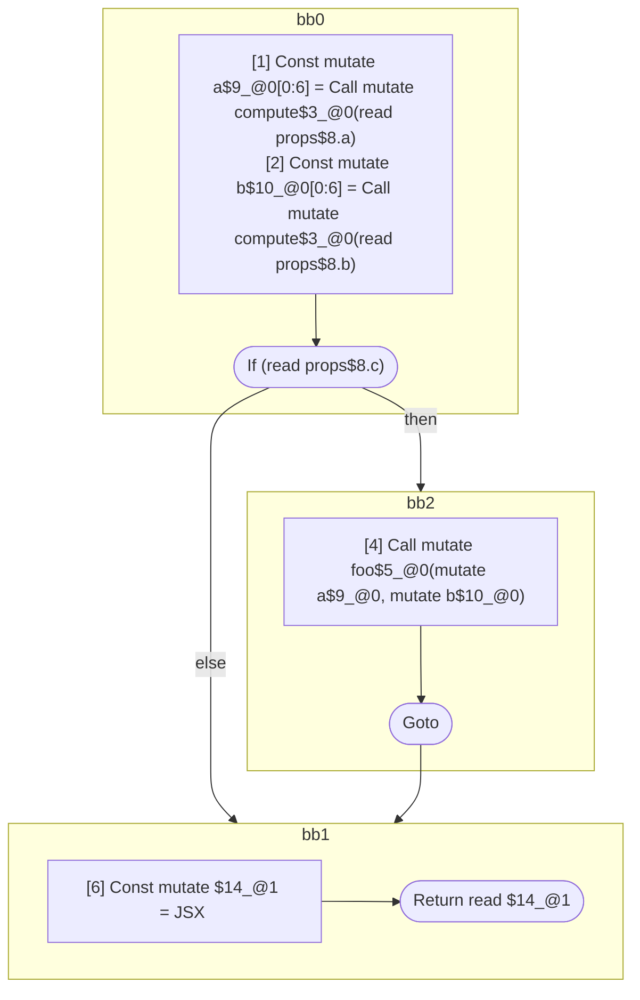

## Input

```javascript
function compute() {}
function foo() {}
function Foo() {}

/**
 * Should produce 1 scope:
 *
 * return: inputs=props.a & props.b & props.c; outputs=return
 *   const a = compute(props.a);
 *   const b = compute(props.b);
 *   if (props.c)
 *     foo(a, b);
 *   return = <Foo a={a} b={b} />
 */
function Component(props) {
  const a = compute(props.a);
  const b = compute(props.b);
  if (props.c) {
    foo(a, b);
  }
  return <Foo a={a} b={b} />;
}

```

## HIR

```
bb0:
  [1] Return

```

### CFG


## Code

```javascript
function compute$0() {}

```
## HIR

```
bb0:
  [1] Return

```

### CFG


## Code

```javascript
function foo$0() {}

```
## HIR

```
bb0:
  [1] Return

```

### CFG


## Code

```javascript
function Foo$0() {}

```
## HIR

```
bb0:
  [1] Const mutate a$9_@0[0:6] = Call mutate compute$3_@0(read props$8.a)
  [2] Const mutate b$10_@0[0:6] = Call mutate compute$3_@0(read props$8.b)
  [3] If (read props$8.c) then:bb2 else:bb1 fallthrough=bb1
bb2:
  predecessor blocks: bb0
  [4] Call mutate foo$5_@0(mutate a$9_@0, mutate b$10_@0)
  [5] Goto bb1
bb1:
  predecessor blocks: bb2 bb0
  [6] Const mutate $14_@1 = JSX <read Foo$6 a={freeze a$9_@0} b={freeze b$10_@0} ></read Foo$6>
  [7] Return read $14_@1
scope1 [6:7]:
 - freeze a$9_@0
 - freeze b$10_@0
```

### CFG



## Code

```javascript
function Component$0(props$8) {
  const a$9 = compute$3(props$8.a);
  const b$10 = compute$3(props$8.b);
  bb1: if (props$8.c) {
    foo$5(a$9, b$10);
  }

  return <Foo$6 a={a$9} b={b$10}></Foo$6>;
}

```
      