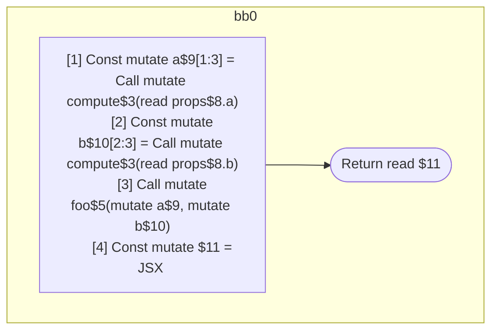

## Input

```javascript
/**
 * Should produce 1 scope:
 *
 * return: inputs=props.a & props.b; outputs=return
 *   const a = compute(props.a);
 *   const b = compute(props.b);
 *   foo(a, b);
 *   return = <Foo a={a} b={b} />
 */
function Component(props) {
  const a = compute(props.a);
  const b = compute(props.b);
  foo(a, b);
  return <Foo a={a} b={b} />;
}

function compute() {}
function foo() {}
function Foo() {}

```

## HIR

```
bb0:
  [1] Const mutate a$9[1:3] = Call mutate compute$3(read props$8.a)
  [2] Const mutate b$10[2:3] = Call mutate compute$3(read props$8.b)
  [3] Call mutate foo$5(mutate a$9, mutate b$10)
  [4] Const mutate $11 = JSX <read Foo$6 a={freeze a$9} b={freeze b$10} ></read Foo$6>
  Return read $11
```

### CFG



## Code

```javascript
function Component$0(props$8) {
  const a$9 = compute$3(props$8.a);
  const b$10 = compute$3(props$8.b);
  foo$5(a$9, b$10);
  return <Foo$6 a={a$9} b={b$10}></Foo$6>;
}

```
## HIR

```
bb0:
  Return
```

### CFG


## Code

```javascript
function compute$0() {
  return;
}

```
## HIR

```
bb0:
  Return
```

### CFG


## Code

```javascript
function foo$0() {
  return;
}

```
## HIR

```
bb0:
  Return
```

### CFG


## Code

```javascript
function Foo$0() {
  return;
}

```
      