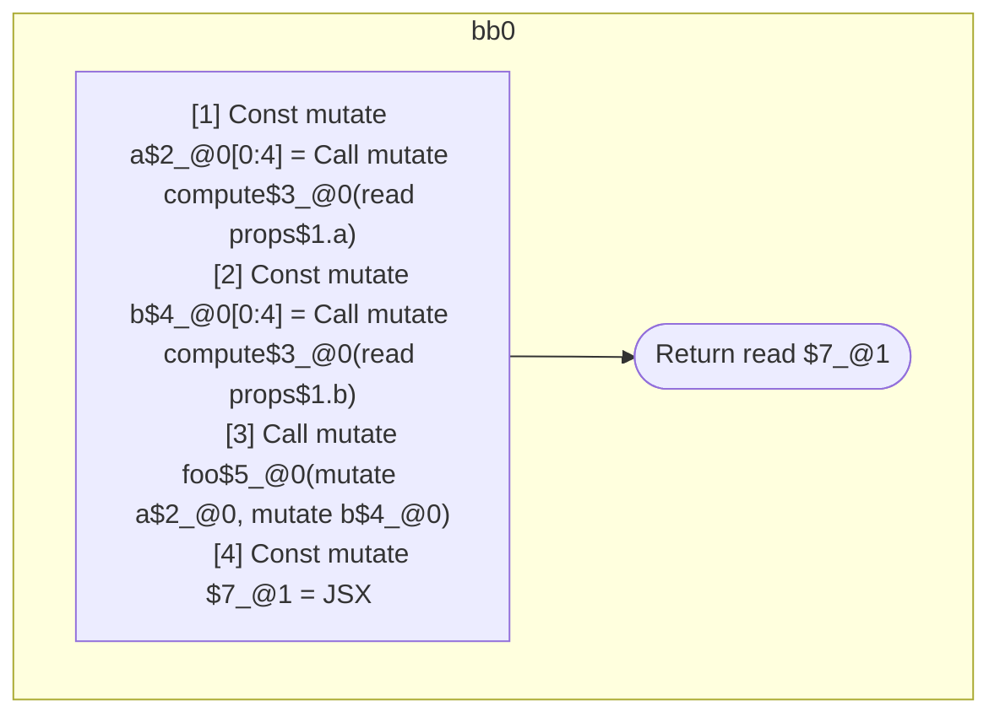
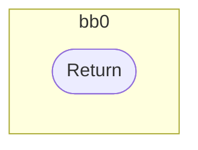

## Input

```javascript
/**
 * Should produce 1 scope:
 *
 * return: inputs=props.a & props.b; outputs=return
 *   const a = compute(props.a);
 *   const b = compute(props.b);
 *   foo(a, b);
 *   return = <Foo a={a} b={b} />
 */
function Component(props) {
  const a = compute(props.a);
  const b = compute(props.b);
  foo(a, b);
  return <Foo a={a} b={b} />;
}

function compute() {}
function foo() {}
function Foo() {}

```

## HIR

```
bb0:
  [1] Const mutate a$2_@0[0:4] = Call mutate compute$3_@0(read props$1.a)
  [2] Const mutate b$4_@0[0:4] = Call mutate compute$3_@0(read props$1.b)
  [3] Call mutate foo$5_@0(mutate a$2_@0, mutate b$4_@0)
  [4] Const mutate $7_@1 = JSX <read Foo$6 a={freeze a$2_@0} b={freeze b$4_@0} ></read Foo$6>
  [5] Return read $7_@1
```

### CFG



## Code

```javascript
function Component$0(props$1) {
  const a$2 = compute$3(props$1.a);
  const b$4 = compute$3(props$1.b);
  foo$5(a$2, b$4);
  return <Foo$6 a={a$2} b={b$4}></Foo$6>;
}

```
## HIR

```
bb0:
  [1] Return
```

### CFG


## Code

```javascript
function compute$0() {}

```
## HIR

```
bb0:
  [1] Return
```

### CFG



## Code

```javascript
function foo$0() {}

```
## HIR

```
bb0:
  [1] Return
```

### CFG


## Code

```javascript
function Foo$0() {}

```
      