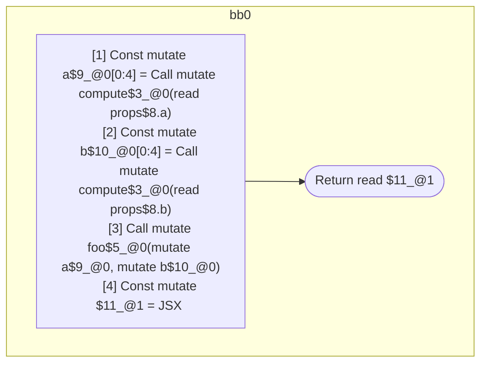

## Input

```javascript
/**
 * Should produce 1 scope:
 *
 * return: inputs=props.a & props.b; outputs=return
 *   const a = compute(props.a);
 *   const b = compute(props.b);
 *   foo(a, b);
 *   return = <Foo a={a} b={b} />
 */
function Component(props) {
  const a = compute(props.a);
  const b = compute(props.b);
  foo(a, b);
  return <Foo a={a} b={b} />;
}

function compute() {}
function foo() {}
function Foo() {}

```

## HIR

```
bb0:
  [1] Const mutate a$9_@0[0:4] = Call mutate compute$3_@0(read props$8.a)
  [2] Const mutate b$10_@0[0:4] = Call mutate compute$3_@0(read props$8.b)
  [3] Call mutate foo$5_@0(mutate a$9_@0, mutate b$10_@0)
  [4] Const mutate $11_@1 = JSX <read Foo$6 a={freeze a$9_@0} b={freeze b$10_@0} ></read Foo$6>
  [5] Return read $11_@1
scope1 [4:5]:
  - dependency: freeze a$9_@0
  - dependency: freeze b$10_@0
```

### CFG



## Code

```javascript
function Component$0(props$8) {
  const a$9 = compute$3(props$8.a);
  const b$10 = compute$3(props$8.b);
  foo$5(a$9, b$10);
  return <Foo$6 a={a$9} b={b$10}></Foo$6>;
}

```
## HIR

```
bb0:
  [1] Return

```

### CFG


## Code

```javascript
function compute$0() {}

```
## HIR

```
bb0:
  [1] Return

```

### CFG


## Code

```javascript
function foo$0() {}

```
## HIR

```
bb0:
  [1] Return

```

### CFG


## Code

```javascript
function Foo$0() {}

```
      