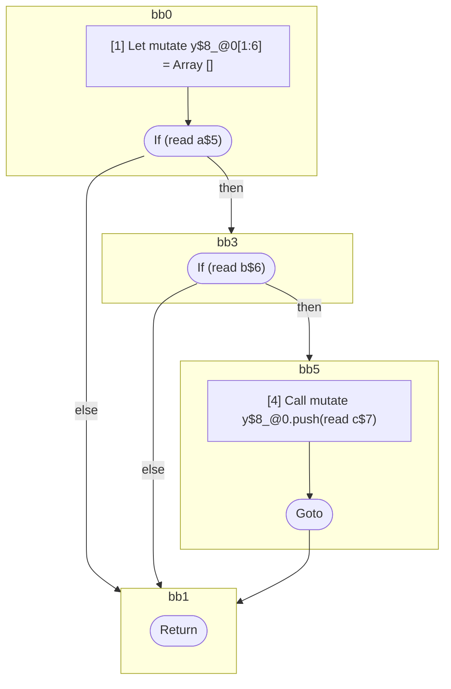

## Input

```javascript
function foo(a, b, c) {
  let y = [];
  label: if (a) {
    if (b) {
      y.push(c);
      break label;
    }
  }
}

```

## HIR

```
bb0:
  [1] Let mutate y$8_@0[1:6] = Array []
  [2] If (read a$5) then:bb3 else:bb1 fallthrough=bb1
bb3:
  predecessor blocks: bb0
  [3] If (read b$6) then:bb5 else:bb1 fallthrough=bb1
bb5:
  predecessor blocks: bb3
  [4] Call mutate y$8_@0.push(read c$7)
  [5] Goto bb1
bb1:
  predecessor blocks: bb5 bb3 bb0
  [6] Return
scope0 [1:6]:
 - read c$7
 - read b$6
 - read a$5
```

### CFG



## Code

```javascript
function foo$0(a$5, b$6, c$7) {
  const y$8 = [];
  bb1: if (a$5) {
    if (b$6) {
      y$8.push(c$7);
    }
  }
}

```
      