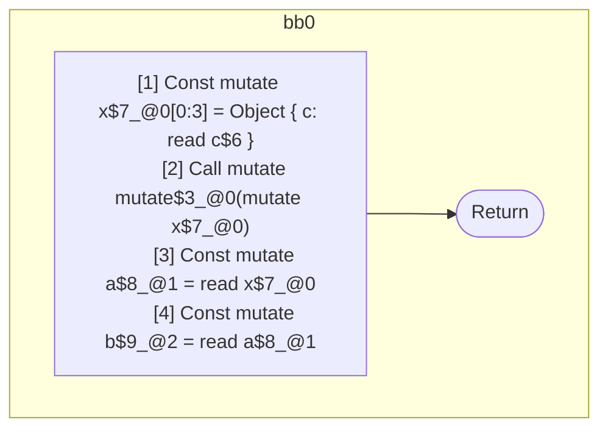

## Input

```javascript
function Component(c) {
  let x = { c };
  mutate(x);
  let a = x;
  let b = a;
}

```

## HIR

```
bb0:
  [1] Const mutate x$7_@0[0:3] = Object { c: read c$6 }
  [2] Call mutate mutate$3_@0(mutate x$7_@0)
  [3] Const mutate a$8_@1 = read x$7_@0
  [4] Const mutate b$9_@2 = read a$8_@1
  [5] Return
scope1 [3:4]:
 - read x$7_@0
scope2 [4:5]:
 - read a$8_@1
```

### CFG



## Code

```javascript
function Component$0(c$6) {
  const x$7 = {
    c: c$6,
  };
  mutate$3(x$7);
  const a$8 = x$7;
  const b$9 = a$8;
}

```
      