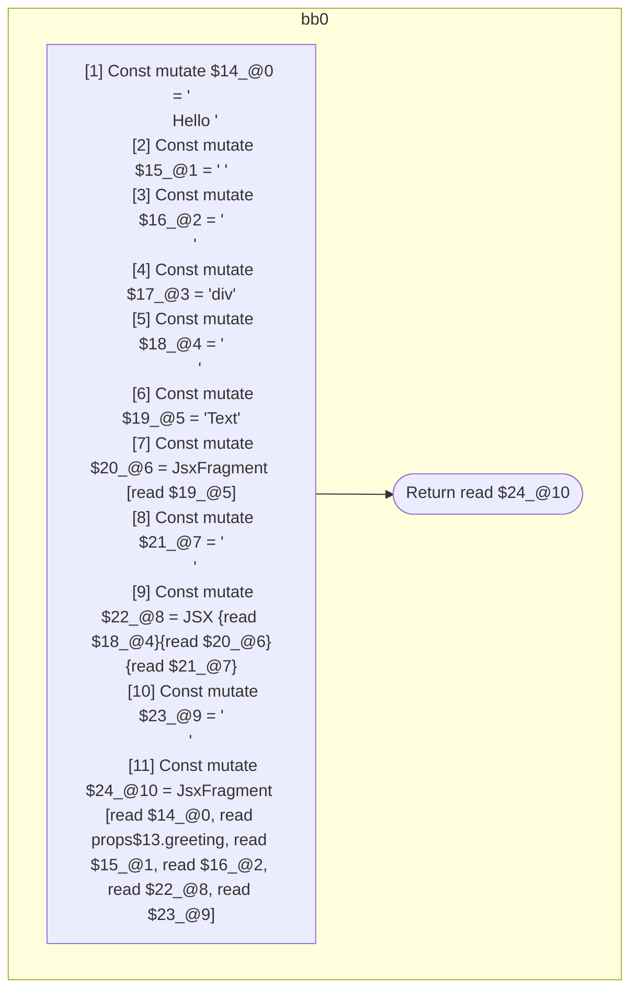

## Input

```javascript
function Foo(props) {
  return (
    <>
      Hello {props.greeting}{" "}
      <div>
        <>Text</>
      </div>
    </>
  );
}

```

## HIR

```
bb0:
  [1] Const mutate $14_@0 = "\n      Hello "
  [2] Const mutate $15_@1 = " "
  [3] Const mutate $16_@2 = "\n      "
  [4] Const mutate $17_@3 = "div"
  [5] Const mutate $18_@4 = "\n        "
  [6] Const mutate $19_@5 = "Text"
  [7] Const mutate $20_@6 = JsxFragment [read $19_@5]
  [8] Const mutate $21_@7 = "\n      "
  [9] Const mutate $22_@8 = JSX <read $17_@3>{read $18_@4}{read $20_@6}{read $21_@7}</read $17_@3>
  [10] Const mutate $23_@9 = "\n    "
  [11] Const mutate $24_@10 = JsxFragment [read $14_@0, read props$13.greeting, read $15_@1, read $16_@2, read $22_@8, read $23_@9]
  [12] Return read $24_@10
```

### CFG



## Code

```javascript
function Foo$0(props$1) {
  return (
    <>
      Hello {props$1.greeting}
      {<div>{<>Text</>}</div>}
    </>
  );
}

```
      