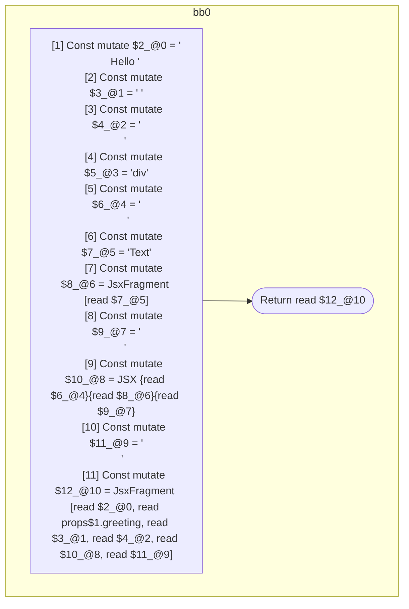

## Input

```javascript
function Foo(props) {
  return (
    <>
      Hello {props.greeting}{" "}
      <div>
        <>Text</>
      </div>
    </>
  );
}

```

## HIR

```
bb0:
  [1] Const mutate $2_@0 = "\n      Hello "
  [2] Const mutate $3_@1 = " "
  [3] Const mutate $4_@2 = "\n      "
  [4] Const mutate $5_@3 = "div"
  [5] Const mutate $6_@4 = "\n        "
  [6] Const mutate $7_@5 = "Text"
  [7] Const mutate $8_@6 = JsxFragment [read $7_@5]
  [8] Const mutate $9_@7 = "\n      "
  [9] Const mutate $10_@8 = JSX <read $5_@3>{read $6_@4}{read $8_@6}{read $9_@7}</read $5_@3>
  [10] Const mutate $11_@9 = "\n    "
  [11] Const mutate $12_@10 = JsxFragment [read $2_@0, read props$1.greeting, read $3_@1, read $4_@2, read $10_@8, read $11_@9]
  Return read $12_@10
```

### CFG



## Code

```javascript
function Foo$0(props$1) {
  return (
    <>
      Hello {props$1.greeting}
      {<div>{<>Text</>}</div>}
    </>
  );
}

```
      