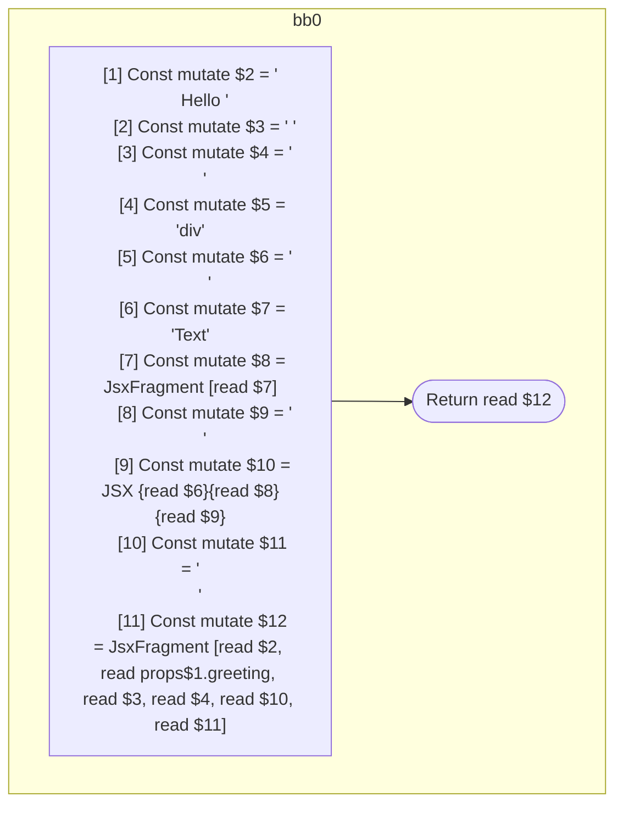

## Input

```javascript
function Foo(props) {
  return (
    <>
      Hello {props.greeting}{" "}
      <div>
        <>Text</>
      </div>
    </>
  );
}

```

## HIR

```
bb0:
  [1] Const mutate $2 = "\n      Hello "
  [2] Const mutate $3 = " "
  [3] Const mutate $4 = "\n      "
  [4] Const mutate $5 = "div"
  [5] Const mutate $6 = "\n        "
  [6] Const mutate $7 = "Text"
  [7] Const mutate $8 = JsxFragment [read $7]
  [8] Const mutate $9 = "\n      "
  [9] Const mutate $10 = JSX <read $5>{read $6}{read $8}{read $9}</read $5>
  [10] Const mutate $11 = "\n    "
  [11] Const mutate $12 = JsxFragment [read $2, read props$1.greeting, read $3, read $4, read $10, read $11]
  Return read $12
```

### CFG



## Code

```javascript
function Foo$0(props$1) {
  return (
    <>
      Hello {props$1.greeting}
      {<div>{<>Text</>}</div>}
    </>
  );
}

```
      