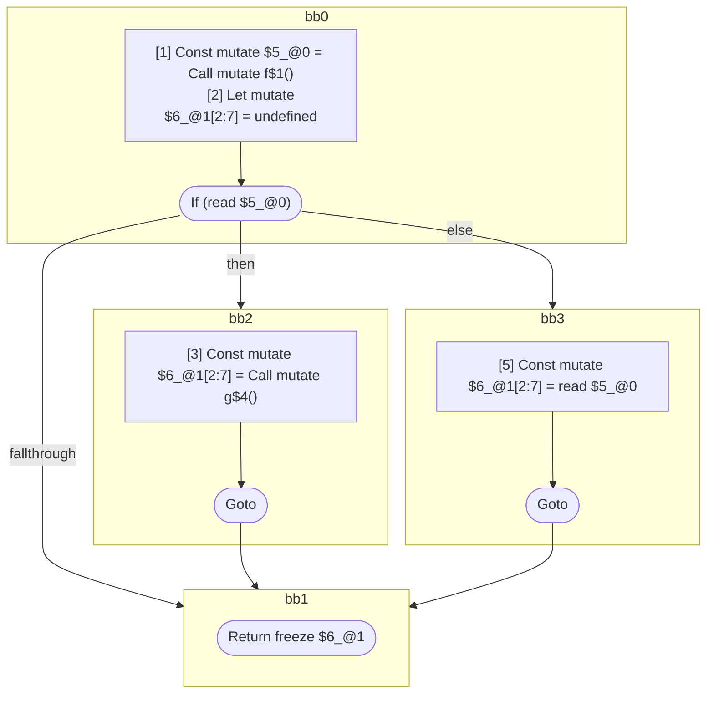
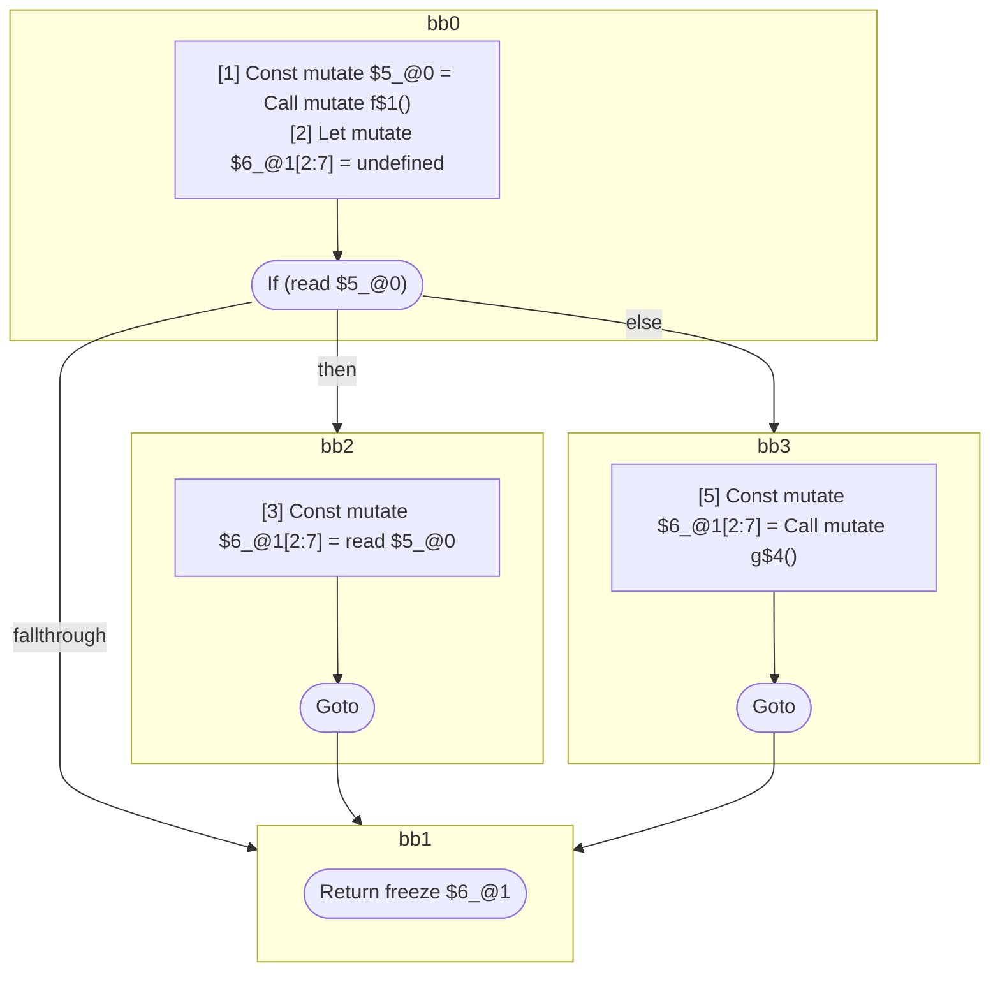
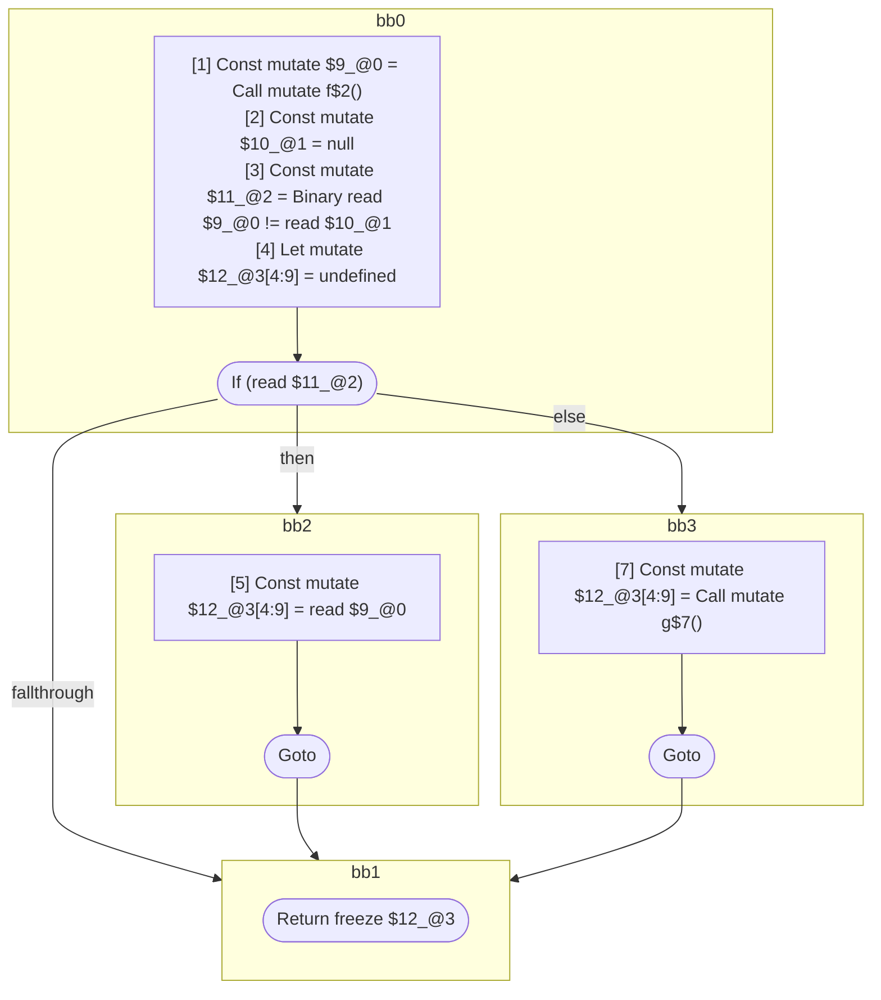
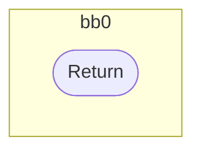

## Input

```javascript
function And() {
  return f() && g();
}

function Or() {
  return f() || g();
}

function QuestionQuestion(props) {
  return f() ?? g();
}

function f() {}
function g() {}

```

## HIR

```
bb0:
  [1] Const mutate $5_@0 = Call mutate f$1()
  [2] Let mutate $6_@1[2:7] = undefined
  [2] If (read $5_@0) then:bb2 else:bb3 fallthrough=bb1
bb2:
  predecessor blocks: bb0
  [3] Const mutate $6_@1[2:7] = Call mutate g$4()
  [4] Goto bb1
bb3:
  predecessor blocks: bb0
  [5] Const mutate $6_@1[2:7] = read $5_@0
  [6] Goto bb1
bb1:
  predecessor blocks: bb2 bb3
  [7] Return freeze $6_@1
scope1 [2:7]:
  - dependency: read $5_@0
  - dependency: read $5_@0
```

## Reactive Scopes

```
function And(
) {
  scope @0 [1:2] deps=[] {
    [1] Const mutate $5_@0 = Call mutate f$1()
  }
  scope @1 [2:7] deps=[read $5_@0, read $5_@0] {
    [2] Let mutate $6_@1[2:7] = undefined
    if (read $5_@0) {
      [3] Const mutate $6_@1[2:7] = Call mutate g$4()
    } else {
      [5] Const mutate $6_@1[2:7] = read $5_@0
    }
  }
  return freeze $6_@1
}

```

### CFG



## Code

```javascript
function And$0() {
  bb1: if (f$1()) {
  } else {
  }
  return f$1();
}

```
## HIR

```
bb0:
  [1] Const mutate $5_@0 = Call mutate f$1()
  [2] Let mutate $6_@1[2:7] = undefined
  [2] If (read $5_@0) then:bb2 else:bb3 fallthrough=bb1
bb2:
  predecessor blocks: bb0
  [3] Const mutate $6_@1[2:7] = read $5_@0
  [4] Goto bb1
bb3:
  predecessor blocks: bb0
  [5] Const mutate $6_@1[2:7] = Call mutate g$4()
  [6] Goto bb1
bb1:
  predecessor blocks: bb2 bb3
  [7] Return freeze $6_@1
scope1 [2:7]:
  - dependency: read $5_@0
  - dependency: read $5_@0
```

## Reactive Scopes

```
function Or(
) {
  scope @0 [1:2] deps=[] {
    [1] Const mutate $5_@0 = Call mutate f$1()
  }
  scope @1 [2:7] deps=[read $5_@0, read $5_@0] {
    [2] Let mutate $6_@1[2:7] = undefined
    if (read $5_@0) {
      [3] Const mutate $6_@1[2:7] = read $5_@0
    } else {
      [5] Const mutate $6_@1[2:7] = Call mutate g$4()
    }
  }
  return freeze $6_@1
}

```

### CFG



## Code

```javascript
function Or$0() {
  bb1: if (f$1()) {
  } else {
  }
  return g$4();
}

```
## HIR

```
bb0:
  [1] Const mutate $9_@0 = Call mutate f$2()
  [2] Const mutate $10_@1 = null
  [3] Const mutate $11_@2 = Binary read $9_@0 != read $10_@1
  [4] Let mutate $12_@3[4:9] = undefined
  [4] If (read $11_@2) then:bb2 else:bb3 fallthrough=bb1
bb2:
  predecessor blocks: bb0
  [5] Const mutate $12_@3[4:9] = read $9_@0
  [6] Goto bb1
bb3:
  predecessor blocks: bb0
  [7] Const mutate $12_@3[4:9] = Call mutate g$7()
  [8] Goto bb1
bb1:
  predecessor blocks: bb2 bb3
  [9] Return freeze $12_@3
scope2 [3:4]:
  - dependency: read $9_@0
  - dependency: read $10_@1
scope3 [4:9]:
  - dependency: read $9_@0
  - dependency: read $11_@2
```

## Reactive Scopes

```
function QuestionQuestion(
  props,
) {
  scope @0 [1:2] deps=[] {
    [1] Const mutate $9_@0 = Call mutate f$2()
  }
  [2] Const mutate $10_@1 = null
  [3] Const mutate $11_@2 = Binary read $9_@0 != read $10_@1
  scope @3 [4:9] deps=[read $9_@0, read $11_@2] {
    [4] Let mutate $12_@3[4:9] = undefined
    if (read $11_@2) {
      [5] Const mutate $12_@3[4:9] = read $9_@0
    } else {
      [7] Const mutate $12_@3[4:9] = Call mutate g$7()
    }
  }
  return freeze $12_@3
}

```

### CFG



## Code

```javascript
function QuestionQuestion$0(props$8) {
  bb1: if (f$2() != null) {
  } else {
  }
  return g$7();
}

```
## HIR

```
bb0:
  [1] Return

```

## Reactive Scopes

```
function f(
) {
  return
}

```

### CFG



## Code

```javascript
function f$0() {}

```
## HIR

```
bb0:
  [1] Return

```

## Reactive Scopes

```
function g(
) {
  return
}

```

### CFG


## Code

```javascript
function g$0() {}

```
      