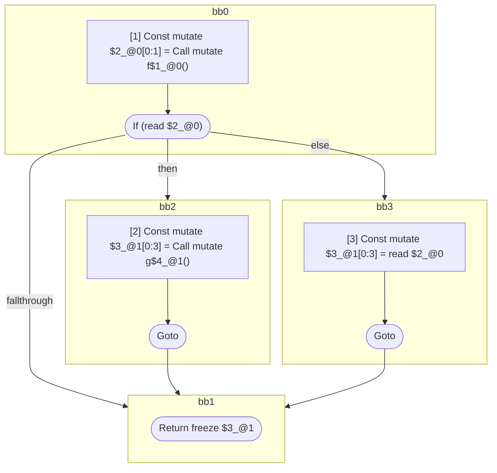
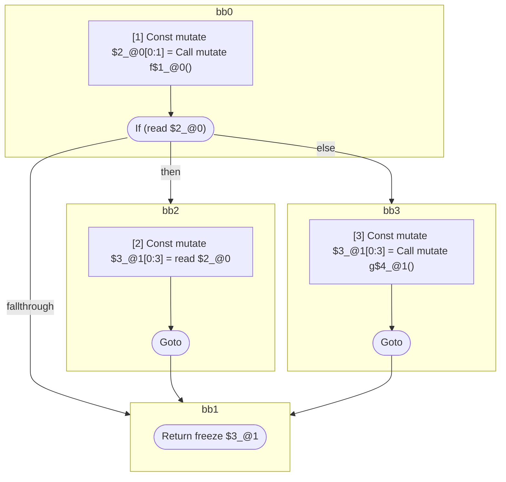
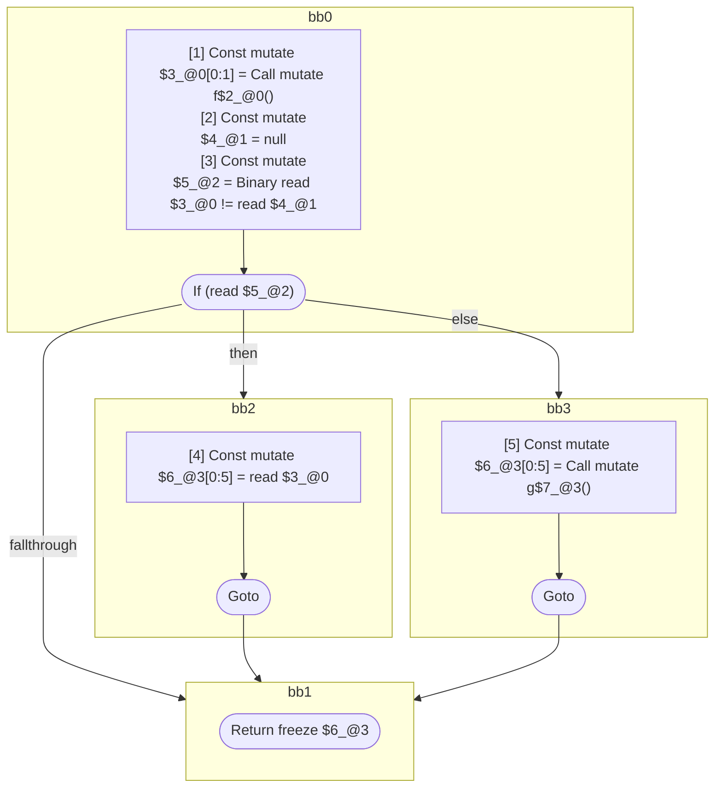

## Input

```javascript
function And() {
  return f() && g();
}

function Or() {
  return f() || g();
}

function QuestionQuestion(props) {
  return f() ?? g();
}

function f() {}
function g() {}

```

## HIR

```
bb0:
  [1] Const mutate $2_@0[0:1] = Call mutate f$1_@0()
  If (read $2_@0) then:bb2 else:bb3
bb2:
  predecessor blocks: bb0
  [2] Const mutate $3_@1[0:3] = Call mutate g$4_@1()
  Goto bb1
bb3:
  predecessor blocks: bb0
  [3] Const mutate $3_@1[0:3] = read $2_@0
  Goto bb1
bb1:
  predecessor blocks: bb2 bb3
  Return freeze $3_@1
```

### CFG



## Code

```javascript
function And$0() {
  bb1: if (f$1()) {
  } else {
  }
  return f$1();
}

```
## HIR

```
bb0:
  [1] Const mutate $2_@0[0:1] = Call mutate f$1_@0()
  If (read $2_@0) then:bb2 else:bb3
bb2:
  predecessor blocks: bb0
  [2] Const mutate $3_@1[0:3] = read $2_@0
  Goto bb1
bb3:
  predecessor blocks: bb0
  [3] Const mutate $3_@1[0:3] = Call mutate g$4_@1()
  Goto bb1
bb1:
  predecessor blocks: bb2 bb3
  Return freeze $3_@1
```

### CFG



## Code

```javascript
function Or$0() {
  bb1: if (f$1()) {
  } else {
  }
  return g$4();
}

```
## HIR

```
bb0:
  [1] Const mutate $3_@0[0:1] = Call mutate f$2_@0()
  [2] Const mutate $4_@1 = null
  [3] Const mutate $5_@2 = Binary read $3_@0 != read $4_@1
  If (read $5_@2) then:bb2 else:bb3
bb2:
  predecessor blocks: bb0
  [4] Const mutate $6_@3[0:5] = read $3_@0
  Goto bb1
bb3:
  predecessor blocks: bb0
  [5] Const mutate $6_@3[0:5] = Call mutate g$7_@3()
  Goto bb1
bb1:
  predecessor blocks: bb2 bb3
  Return freeze $6_@3
```

### CFG



## Code

```javascript
function QuestionQuestion$0(props$1) {
  bb1: if (f$2() != null) {
  } else {
  }
  return g$7();
}

```
## HIR

```
bb0:
  Return
```

### CFG


## Code

```javascript
function f$0() {
  return;
}

```
## HIR

```
bb0:
  Return
```

### CFG


## Code

```javascript
function g$0() {
  return;
}

```
      